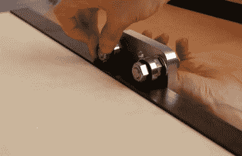

# 打样机证明了 DIY 是一件好事

> 原文：<https://hackaday.com/2021/01/29/proofing-press-proves-diy-is-a-ok/>

回到大多数人用木浆阅读新闻的时代，报纸会在小型打样机上进行试印。这让他们有机会在真正的印刷机上印刷成千上万份报纸之前检查印刷错误。

这些印刷机不仅可以用于凸版印刷打样，正如[Paul]用这个 DIY 版本证明的那样。它们是简单的机器，使用轴承上的重型滚筒来提供均匀的压力，所以它们也适用于 lino-cut 版画和 aquatint 蚀刻。

 滚轴是最重要的部件，也是最昂贵的部分。[保罗]的是由他在 ebay 上找到的一位英国机械师制作的。总成本为 220 英镑(约 300 美元)，远低于商用机器的 1000 英镑起价。

[Paul]用胶合板做了底座和把手，用铝做了侧板。这些侧板包含轴承，用于固定滚筒的末端。当辊子前后移动时，它在印刷机下面的另一组轴承上滑动。这些轴承安装在压机底部的薄金属轨道上，这样它们就不会随着时间的推移在木头上磨出凹槽。

[保罗]的媒体看起来棒极了，看起来他做的每件事都做得很好。有些用途需要抬高要打印的表面以获得良好的转印，因此[Paul]可能会在未来的某个时间点使其在 z 方向上可调。休息之后，请观看构建和演练视频。

如果[保罗]看起来很熟悉，那是因为我们去年春天特别介绍了他同样令人印象深刻的大幅面图书出版社。

 [https://www.youtube.com/embed/5wa0a3vTafE?version=3&rel=1&showsearch=0&showinfo=1&iv_load_policy=1&fs=1&hl=en-US&autohide=2&wmode=transparent](https://www.youtube.com/embed/5wa0a3vTafE?version=3&rel=1&showsearch=0&showinfo=1&iv_load_policy=1&fs=1&hl=en-US&autohide=2&wmode=transparent)

