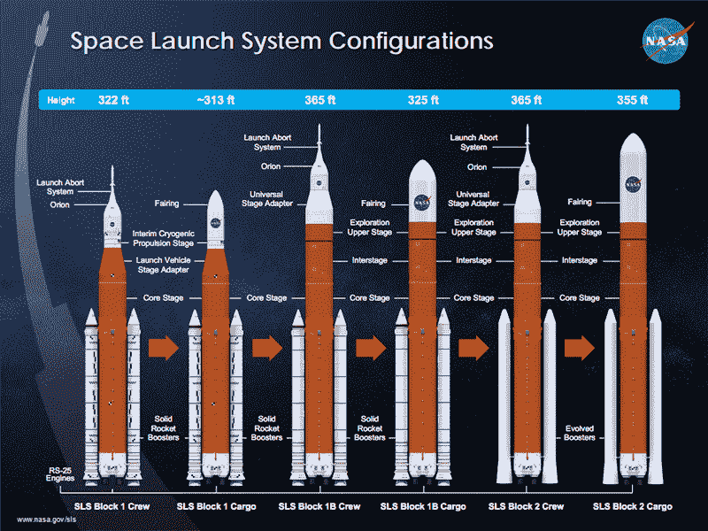

# 美国国家航空航天局的拟议预算标志着航天发射系统的变化

> 原文：<https://hackaday.com/2019/03/13/proposed-nasa-budget-signals-changes-to-space-launch-system/>

白宫提出的 2020 年预算已经出台，随之而来的是对美国国家航空航天局的削减。拟议预算中最重要的一项是太空发射系统 SLS 的延期，SLS 是一种为一次性使用而设计的超重型运载火箭。拟议的延迟将推迟增强版补充劳工计划的工作，即 1B 区块的勘探上面级。

目前太空发射系统的计划包括 2020 年 6 月使用美国宇航局的猎户座飞船绕月飞行。这次无人审查的飞行，探索任务 1，或 EM-1，将使用 SLS Block 1 乘员火箭。随后的 EM-2 将在 2022 年驾驶载人猎户座太空舱绕月飞行。第三次计划在 2023 年发射，将欧罗巴快船送往木星。拟议的 2020 年预算将这些航班置于危险之中。

美国宇航局 2020 年预算的拟议削减将推迟临时低温推进级(ICPS)的建设，以专注于更大的探索上面级。ICPS 是德尔塔 III 和德尔塔 IV 火箭末级的衍生产品。探索上面级将明显更大，允许整个助推器将 105 吨送入近地轨道，或将 37 吨送入月球。

从拟议的 NASA 预算中可以收集到的推理似乎表明，削减 ICPS 是为了提前时间表，让 SLS 更快地做它最擅长的事情。虽然 Block I SLS 甚至比猎鹰重型更有能力，但它仍然比升级后的 Block 1B SLS 差得多。猎鹰重型能够提升 50 吨到低地球轨道，正如蓝色起源未经测试的新格伦一样。只有土星五号可以携带更多的东西进入轨道，近地轨道的最大有效载荷超过 140 吨。

航天发射系统的 1B 区块的取消使几个任务成为问题。最值得注意的是，欧洲提供加油、基础设施和电信系统(ESPRIT)和美国利用模块 LOP-G 的交付，[这是将空间站发射到一个奇怪的轨道上，*看起来* *像*一个高度偏心的绕月极地轨道](https://hackaday.com/2019/02/25/nasa-is-building-a-space-station-in-a-weird-orbit-heres-why/)。这次发射目前计划在 2024 年进行[探索任务 3](https://en.wikipedia.org/wiki/Exploration_Mission-3) ，这是一项将四名宇航员送上月球以建造月球门户的任务。使用 Block 1B SLS 的进一步任务如下:2025 年至 2028 年为期一至两个月的任务将建造月球网关，最高成就是将四名宇航员发射到月球网关，执行为期六个多月的任务。

太空发射系统的目标是建造一台机器，将人类和大量的有效载荷带到月球和更远的地方。随着猎鹰重型的成功发射，蓝色起源的新格伦的开发，以及阿丽亚娜 6 的预计 2020 年发射，重型起重发射器的市场非常拥挤。白宫提出的预算仍然支持建设月球网关，但表示这些模块“将在竞争性采购的车辆上发射，补充 SLS 和猎户座的乘员运输飞行。”

尽管白宫的预算确实列出了许多对太空探索的削减，但不能保证这项预算会通过；这份预算仅仅是向国会提出的建议，国会必须通过自己的政府预算。太空发射系统本身在国会得到了很好的支持，过去被恰当地称为参议院发射系统。这是经过设计的，也是美国宇航局组织结构的一部分，可以追溯到 1958 年。过渡低温推进阶段是否会在 SLS 上飞行仍有待观察，但无论如何，我们最终都会重返月球，大部分有效载荷将由航天发射系统运送。