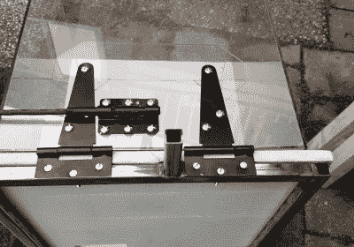

# Prusa Mini 获得定制重型外壳

> 原文：<https://hackaday.com/2020/11/17/prusa-mini-gets-custom-heavy-duty-enclosure/>

还在等你的 Prusa Mini 来吗？加入俱乐部。在对廉价 3D 打印机和新冠肺炎疫情的惊人兴趣之间，机器可能需要几个月才能到达你的家门口。但是，病人制造商终于收到了他们的新打印机，因此，黑客和修改开始渗透进来。

首先是来自[Build Comics]的这个[华丽过度设计的外壳。](https://buildcomics.com/hero/3dp-a-new-hero-and-its-home/)虽然 PLA 和 PETG 通常使用加热床就能打印出很好的效果，但 ABS 等更复杂的材料在打印机封闭时效果最佳，因为它有助于保持一致的温度。此外，它使任何好奇的手和爪子与热的移动位保持安全距离，如果事情真的变得像梨形，可以帮助控制烟雾和火焰。

 外壳由焊接的钢方管、木材、阻燃纤维板制成。一个铰链聚碳酸酯盖，采用四面立方体的形式，通过一些重型铰链降低到打印机上，看起来像是打算用于围栏。为了防止盖子摔下来，[Build Comics]想出了一种简单的锁定机制，可以很容易地从外壳的前面或侧面操作。通过增加一个小型的温度和湿度显示器，可以很容易地监控室内的条件。

但是【打造漫画】并没有就此止步。他还安装了一个继电器盒，如果安装在打印机上方的烟雾探测器跳闸，它将切断打印机的电源。虽然没有理由认为 Prusa Mini 会遭受早期预算桌面 3D 打印机的相同命运，但采取预防措施肯定没有坏处。

每当你的 Prusa Mini 出现时，你需要建造一个类似的围栏吗？也许不是。但是如果你想这么做，至少现在你已经有了足够多的图片和细节，可以帮助你提出自己的解决方案。