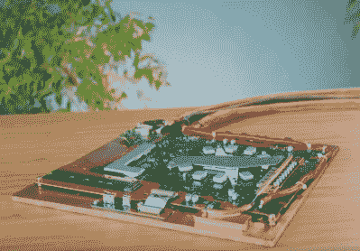

# PS5 运行速度非常快

> 原文：<https://hackaday.com/2022/06/20/ps5-goes-on-slim-fast/>

在过去的几十年里，大多数主机制造商首先推出大型旗舰机型，然后在几年后，发布更小、更紧凑的超薄版本。不满足于等待， *DIY Perks* [的【马特】自己做了 PS5 Slim](https://www.youtube.com/watch?v=he6xyl_MHXY) ，结果令人惊叹。

一般来说，超薄版是通过降低引擎盖下芯片的 TDP 制成的。更低的功耗意味着需要更少的冷却，可以使用更小的电源，并且设计总体上更易于管理。不幸的是，[马特]没有这些好处，而是不得不与 PlayStation 内部的 AMD CPU 可以提取的全部 180 W 功率相抗衡。

 拆开控制台留给他的是主板，由于两边都有热管，主板相当厚。他首先想到的是水冷，因为它可以快速转移所需的热量，但即使采用直角配件，也不符合他为自己设定的不到 2 厘米(约 3/4 英寸)的雄心勃勃的厚度目标。为了做到这一点，[马特]必须用三片铜片制作一个铜制防水块。第一个通过支架连接到主板，并有各种连接器和零件的切口。中间层有一个通道，水可以通过它流动，最后一层把它密封在一起。

将三层焊在一起，他将它们焊接在一个被改造成回流焊炉的烤面包机里。聪明的是，他使用硅脂来防止焊料进入他不想要的区域，比如 CPU 模块中的散热片。幸运的是，油脂溶解在酒精中，冲洗后，他有了一个坚固的铜制防水定制环。然而，在他走向辉煌的道路上，[马特]遇到了阻碍。他不小心盖住了散热器上的进气口，PS5 过热，导致死亡。由于主板烧毁，一个项目即将完成，他求助于使用他收到的 B-roll 的 PS5。

抛开最后一刻的主板交换不谈，最终的项目是华丽的。它抛光的外表和极薄的厚度引人注目。[Matt]在之前已经[伪装了他的 PS5，在这之后，我们不太确定他接下来可能会把它带到哪里。但我们很兴奋地发现。](https://hackaday.com/2021/05/26/disguising-the-ps5-with-a-custom-wood-and-carbon-fiber-enclosure/)

 [https://www.youtube.com/embed/he6xyl_MHXY?version=3&rel=1&showsearch=0&showinfo=1&iv_load_policy=1&fs=1&hl=en-US&autohide=2&wmode=transparent](https://www.youtube.com/embed/he6xyl_MHXY?version=3&rel=1&showsearch=0&showinfo=1&iv_load_policy=1&fs=1&hl=en-US&autohide=2&wmode=transparent)

