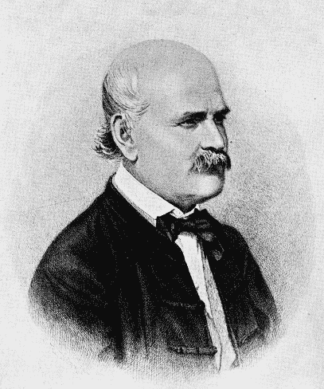
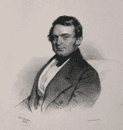
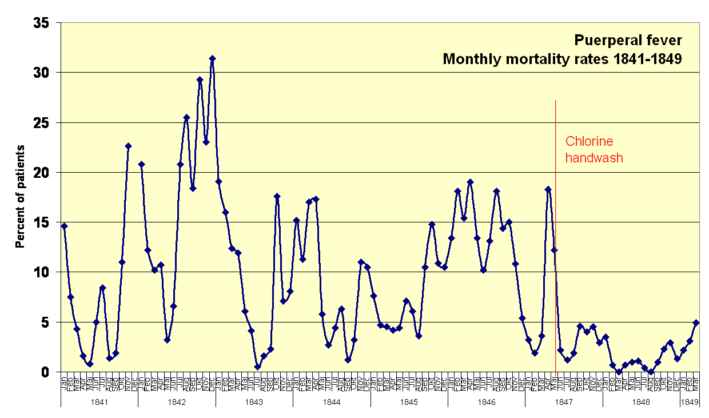

# 出版或灭亡:伊格纳斯·塞梅尔维斯的悲哀天才

> 原文：<https://hackaday.com/2018/08/28/publish-or-perish-the-sad-genius-of-ignaz-semmelweis/>

在生活教给我们的所有课程中，最难的一课是，你可能在某件事上是对的，但仍然会遇到麻烦。通常这是在生命早期学到的，但我们中太多的人在成年后仍回避这个残酷的事实。在这些情况下，正确实际上是生死攸关的事情，学习这一课就更加困难了。

对于 19 世纪中期的匈牙利医学科学家 Ignaz Semmelweis 来说，没有认识到正确伴随着某些责任的代价非常高。具有讽刺意味的是，这项革命性的发现也将拯救无数女性的生命，这项发现在今天看来如此简单，不言而喻:医生在见病人之前应该洗手。

## 除了第一诊所

当 Semmelweis 于 1818 年出生在匈牙利城市布达时，医学刚刚从文艺复兴时期和之前的黑暗时代积累的错误观念和弊端中脱颖而出。放血，虽然不再是医生的首选疗法，但仍然被采用，尽管这一程序寻求平衡的“四种体液”在很大程度上被放弃作为健康和疾病的解释，而倾向于“瘴气”或糟糕的空气。医生终于开始将启蒙时代的进步和科学方法应用于疾病的诊断和治疗——但仅仅是勉强应用。

Ignaz Phillip Semmelweis. Source: [The Semmelweis Society](https://semmelweis.org/)

Semmelweis 是一个富商的儿子，他通过学习法律走了一条迂回曲折的医学道路，但到了 1846 年，他赢得了维也纳总医院产科病房的任命。这是一个声望不高的职位，也不是他的首选，但 Semmelweis 投身于一个专门为维也纳社会贫困阶层服务的机构中忙碌的医生的日常工作中，对他们来说，杀婴似乎是一种合理的节育方法。

为了阻止这种做法，医院向孕妇提供免费护理，其结果是产科诊所的医生应接不暇。为了解决人员过剩的问题，建立了第二个产科诊所，全部由助产士组成。这两家诊所很快在维也纳人中间树立了相反的名声。在 19 世纪，第二诊所被视为与任何处理分娩的地方一样安全，而第一诊所被广泛认为是死刑判决:在那里分娩的妇女很可能会死在那里。

作为第一诊所的一名工作人员，Semmelweis 痛苦地意识到这个名声，并着手研究这个问题。他发现，虽然统计数据并不像街上说的那么糟糕，但仍然令人震惊:在第一家诊所分娩的妇女中，足足有 13%死于产后感染，而第二家诊所相同并发症的发生率仅为 2%。这似乎违背了事实；毕竟，第一个诊所的工作人员是医生，比第二个诊所的助产士更有学问和技能。当然，仅凭这一事实就应该让结果向另一个方向倾斜。会发生什么？

## 为朋友举行葬礼

Semmelweis 急于得到一个解释，于是开始对两家诊所进行彻底的调查。他对死于所谓的“产床热”或“产褥热”的妇女进行了尸检，试图了解她们的死因。他指出，在医院外分娩但后来住院的妇女在感染率方面没有同样的差异，这一发现表明，分娩的实际过程使第一次门诊病人暴露于产褥热。

他认为使用的方法可能是罪魁祸首，于是命令两家诊所交换程序。这对死亡率没有任何影响，只是惹恼了医院的工作人员，并让 Semmelweis 降级。这不是他的傲慢第一次让他与维也纳医疗机构发生冲突，当然也不会是最后一次。

The unfortunate Dr. Kolletschka. Source: [The Wellcome Trust](https://blog.wellcome.ac.uk/2010/05/13/history-of-medicine-unwitting-martyr/)

Semmelweis 的突破来自一个看似随机的悲剧。他的朋友 Jakob Kolletschka 是一名法医学教授，当时他正带领一名学生徒手进行尸检，这是当时的标准做法。这名学生不小心用手术刀刺伤了 Kolletschka 的手指，几天后医生就死了。Semmelweis 查看了他朋友的尸检记录，发现他患有与死于产褥热的妇女完全相同的症状。Kolletschka 解剖的尸体可能是感染源吗？

一瞬间，Semmelweis 看到了答案。只有医生进行尸体解剖，而且通常是在早上第一个诊所见病人之前进行。看起来很可能是医生自己在解剖室和第一诊所的产房之间传播病原体。看起来他们是赤手空拳。

在导致他被降职的一次行动中，Semmelweis 规定，所有第一诊所的医生都必须用氯化石灰或次氯酸钙洗手，类似于普通的家用漂白剂，以清除“苍白的颗粒”。他的第一个诊所同事对这个想法很恼火——从字面上看，因为漂白剂对皮肤很刺激。但他们也抱怨说，神圣的医生可能是传染病的携带者，这是不可想象的，塞梅尔韦斯没有提供任何证据证明这一理论。更糟糕的是，他通过积极执行他的新规则，监督他们的卫生和呼唤违法者，进一步不受欢迎。

## 好心没好报

尽管他的新规则不受欢迎，但统计数据很清楚:洗手制度一实施，第一诊所的死亡率就骤降了 90%。几个月内，产褥热的死亡率下降到了零。Semmelweis 被证明是对的，他在拯救生命。

可悲的是，这并没有持续多久。他从未能解释清楚洗手是如何工作的。巴斯德几年后才形成了疾病的细菌理论，因此塞麦尔维斯缺乏解释他的突破的框架。他只知道这是有效的，他固执地坚持医生必须遵守他的规则，这激怒了当权者，足以让他被解雇。他回到匈牙利，并最终成为佩斯医院的产科主任，在那里，他的卫生规则再次大幅降低了产褥热的死亡率。与此同时，回到维也纳，第一诊所的业务恢复正常，死亡率飙升。

Numbers speak louder than words. Note the beginning of a trend up in rates at the end of the graph, once Semmelweis was dismissed. By [Power.corrupts](Power.corrupts) – Own work, Public Domain, [Link](https://commons.wikimedia.org/w/index.php?curid=4765094 "User:Power.corrupts")

出于未知的原因，Semmelweis 一直拒绝发表他的结果，甚至拒绝发表公开演讲。他最终被说服写了一本书《产床热的病因、概念和预防》。这部分是他的发现的漫无边际的历史，部分是医院卫生的指导手册，但最令人不安的是，后半部分是对那些怀疑他和他的结果的人的恶毒攻击。他甚至叫出了所有那些不遵守他的规则的杀人犯。

他的书在商业上失败了，他变得越来越不稳定，以至于在公共场合大声哭喊，在街上和年轻夫妇搭讪，恳求他们确保他们的医生在他们有孩子时洗手。1865 年，他的妻子和家人担心他的精神健康，说服他去奥地利度假。当他们到达维也纳时，他的妻子建议他们去医院看望一位老朋友。但是迎接 Semmelweis 的不是一张友好的脸，而是穿着紧身衣的魁梧护理员。他被骗进了精神病院。几天之内，他就会死去，可能是在一次试图逃跑时受伤，也可能是被警卫毒打致死。不管是哪种情况，他都是讽刺性地死去的；他的尸检显示死于败血症，本质上是他用洗手程序拯救了无数妇女的同一种疾病。

Semmelweis 死的时候没有学习过细菌理论，该理论可以解释细菌是神秘的“尸体颗粒”,通过医生肮脏的手传播给第一次就诊的病人。他死时认为他的努力白费了，他的手术永远不会被当权者接受。他至少要为此负部分责任，因为他态度粗暴，傲慢地坚持要每个人都遵守他的规则，不做任何解释，而且没有传达他的结果。这并没有使他的命运变得不那么残酷，但事实仍然是，他确实用科学拯救了生命，他的固执最终确实使医学变得更好。