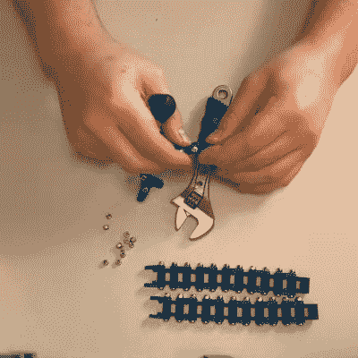

# 测试 3D 打印链的性能

> 原文：<https://hackaday.com/2021/05/15/putting-3d-printed-chain-through-its-paces/>

在过去的几十年里，制造商面临的最令人沮丧的事情之一是动力传输的问题。为你的项目寻找像皮带、滑轮、链轮和链条这样的东西可能会很困难，特别是如果你住的地方远离像 McMaster-Carr 这样的供应商的运输半径。如今，没有必要大惊小怪，因为你可以简单地 3D 打印你需要的任何东西，[就像【让我们打印】通过搅动一些链条所展示的那样。](https://www.youtube.com/watch?v=y3Vb19QE6iI)

 链条是一种混合设计，[用螺栓和螺母将塑料内外链环结合在一起](https://thangs.com/Lets-Print/3D-Printable-CHAIN-05-Pitch-12561)将它们紧固在一起。[让我们打印]尝试了 ABS、PLA 和 PETG 的几种组合，在 3D 打印的链轮上运行它们，并确定它们都是功能性的，尽管是在最小负载下。链条也要经过拉伸测试，方法是将一个沉重的制动盘连接到一段链条上，放下重物，看看链条在哪个点断裂。

我们希望看到更多 3D 打印的链条；全塑料卡扣式设计，甚至那些预先组装打印的设计都是特别诱人的想法。我们也喜欢在适当的扭矩负载下对链条进行更多的测试，而不仅仅是自由旋转。

我们以前也看过[让我们打印]的作品——[这个令人敬畏的水泵的例子。休息后的视频。](https://hackaday.com/2020/09/29/eight-motors-can-sure-pump-a-lot-of-water/)

 [https://www.youtube.com/embed/y3Vb19QE6iI?version=3&rel=1&showsearch=0&showinfo=1&iv_load_policy=1&fs=1&hl=en-US&autohide=2&wmode=transparent](https://www.youtube.com/embed/y3Vb19QE6iI?version=3&rel=1&showsearch=0&showinfo=1&iv_load_policy=1&fs=1&hl=en-US&autohide=2&wmode=transparent)

