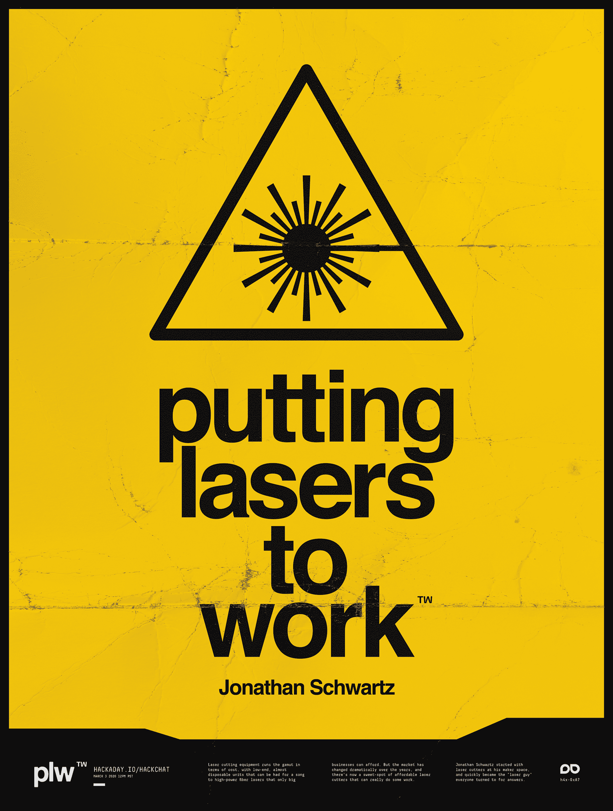

# 将激光用于黑客聊天

> 原文：<https://hackaday.com/2021/03/01/putting-lasers-to-work-hack-chat/>

加入我们太平洋时间 3 月 3 日星期三中午的[把激光用于工作黑客聊天](https://hackaday.io/event/177240-putting-lasers-to-work-hack-chat)与[乔纳森·施瓦兹](https://hackaday.io/hacker/1172904-jonathan-schwartz)！

就成本而言，激光切割设备涵盖了所有领域，从价格低廉的低端、几乎一次性的设备，到只有大企业才能负担得起的高功率光纤激光器。但是这些年来，市场发生了巨大的变化，现在有了一个实惠的激光切割机，可以真正做一些工作。虽然许多业余爱好者已经冒险在他们的商店里添加了这样一个激光切割机，但还有一些人已经看到了这些多功能的工具，并意识到可以围绕它们建立一个企业。

在下一次聊天中，我们将和乔纳森·施瓦兹坐在一起。他从他的创客空间的激光切割机开始，并很快成为每个人都向其寻求答案的“激光人”。凭借大约 10 年的经验，Jon 在洛杉矶成立了美国激光切割机公司，提供定制的激光雕刻和切割服务。他围绕中档激光切割机建立了一个企业，并准备分享他所学到的东西。加入我们，讨论激光切割业务中的机器、材料和服务，并了解激光切割师的一些技巧。

 我们的黑客聊天是 [Hackaday.io 黑客聊天群发消息](https://hackaday.io/messages/room/2369)中的社区直播活动。本周，我们将在太平洋时间 3 月 3 日星期三中午 12:00 坐下来讨论。如果时区束缚了你，我们有[一个方便的时区转换器](https://www.timeanddate.com/countdown/generic?iso=20210303T12&p0=224&msg=Putting+Lasers+to+Work+Hack+Chat&font=cursive)。

点击右边的那个发言气泡，你会被直接带到 Hackaday.io 上的黑客聊天群，不用等到周三；随时加入，你可以看到社区在谈论什么。

