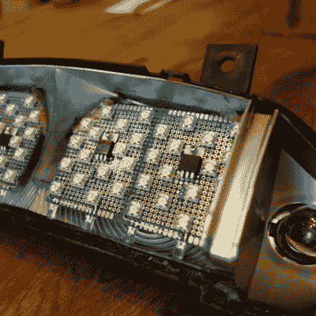

# 在摩托车尾灯上安装发光二极管显示了琐碎变得多么困难

> 原文：<https://hackaday.com/2021/05/25/putting-leds-in-motorcyle-tail-light-shows-how-trivial-becomes-tough/>

[马顿·特罗普]用 LED 替代他摩托车的尾灯是一个很好的例子，说明了每个黑客迟早都会学到的东西:与现有部件连接并解决问题可以将一个看似琐碎的任务变成比预期大得多的工作。一个人越是不得不在现有系统的约束下工作，就越有机会遇到阻碍和意外问题来阻碍进展，这个项目就是一个很好的例子。

 【马腾】的 1999 年本田 ST1100 泛欧摩托车没有 LED 尾灯组件的售后选项，他也不太热衷于只安装通用模块来取代原始模块。相反，他决定购买和拆卸一个旧的工厂组件，并用一些等效的 led 取代白炽灯。用 led 代替灯泡听起来很容易，但最终做好这项工作花了 Maarten 将近两周的时间。

问题从简单的事情开始，比如如何打开灯组件本身。该装置不可由用户维修，也不打算打开，部件用蜡状物质密封。幸运的是，热量起了作用。另一个早期的障碍是灯组件的弯曲底座，这使得安装平板或 veroboard 成为一个挑战。最终，[Maarten]选定了高亮度 led 的三角形网格，由配置为恒流电源的 LM317 调节器驱动，安装在一些原型板上，以适应组件的独特曲线。结果可以接受摩托车电池的宽电压范围(从 10.5 V 到 14.5 V)，即使一些单独的 led 停止工作，它仍然可以工作。

该项目提供了另一个例子，说明围绕现有硬件工作是多么痛苦。[Maarten]原本打算将转向信号灯也换成 led，但出现了一个小故障。如果检测到烧坏的转向信号灯，摩托车的转向信号继电器将快速闪烁。由于发光二极管消耗的电流比原来的灯泡少得多，继电器将一直卡在故障状态。有一些不同的方法可以解决这个问题，但是这个问题留待以后解决。目前，尾灯 LED 更换是成功的。

围绕现有硬件[工作经常会带来意想不到的挑战](https://hackaday.com/2018/01/14/not-so-simple-led-upgrade-for-microscope/)，但是当涉及到安全系统(如车辆上的灯)时，确保事情做得正确就显得格外重要。