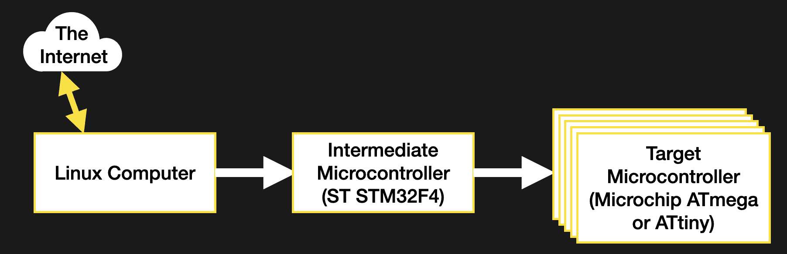

# 将固件放入您的固件

> 原文：<https://hackaday.com/2020/09/15/putting-the-firmware-in-your-firmware/>

在现场对设备进行无线更新可能是一件棘手的事情。可靠性和恢复当然是关键，但即使将正确的位存储到正确的存储扇区也是一项挑战。最近我一直在做一个项目，要求设计一种新的途径来更新一些非常不方便的小型微控制器。

像这样的项目有很多部分；执行实际更新的引导加载程序、健壮的通信协议、恢复路径、文件传输机制等等。让这些微型计算机特别不方便的是，它们本身并没有联网，而是需要通过另一个中间控制器进行跳跃，而中间控制器本身也没有联网。可以预见的是，原本简单的“文件传输”步骤很快膨胀成一个复杂的任务洋葱，在项目的其余部分可以继续之前完成。就像他们说的，一路微跌。



The system de jour

正在讨论的系统并不特别奇特。相关部分由连接到网络的 Linux 计算机组成，该计算机连接到大型微控制器，连接到各种较小的控制器以管理各种任务。我需要能够更新较小控制器的扇出。为了降低复杂性，我决定让中间微控制器负责其子节点的更新过程。但这提出了一个新的问题；我们如何将固件映像放入中间控制器？

问题中的微处理器相当强大，有一大块外部闪存([用 littleFS 格式化，自然是](https://hackaday.com/2019/01/24/cool-tools-a-little-filesystem-that-keeps-your-bits-on-lock/))，但是将文件放入闪存将迫使我为 Linux 计算机开发一个文件系统接口。这不是一个问题，但这是一项很大的工作，而且是对手头任务的重大转移:引导那些该死的控制器！然后有人提出了一个很好的方法来简化这个过程，几乎什么都不用做；如果我将目标固件映像与中间控制器本身的固件捆绑在一起会怎么样？然后刷新中间程序也可以免费传输有效载荷固件！这绝对是一个快速的策略，但是如何去做呢？这是一个比我预料的更有趣的问题。让我们看看如何将图像导入固件。

# 图像选项

我探讨了执行固件映像捆绑的四种方法:将有效负载固件编译为头文件，将其链接为目标文件或修改编译后的输出以注入它，以及直接编辑最终的二进制文件。除了其他不同之处，这些策略中的每一个都适合在开发过程的不同点上使用。链接只有在编译固件时才有意义，链接器技巧在编译后才起作用，二进制编辑可以在二进制完成后的任何时候发生。

由于这是一个更大的以稳定性为中心的项目的组成部分，跟踪每个单独的固件映像的确切版本对于寻找 bug 和可追溯性是极其重要的。理想情况下，每个图像都应该是解耦的，这样就可以单独修改它们，而不需要重新编译所有内容。由于中间和目标微控制器具有不同的架构，因此需要三个映像(每个控制器运行一个单独的应用)和两个工具链，这进一步增加了问题的复杂性。尽管这四个选项中有一个最符合我的需求，但这四个选项都值得讨论。

## 经典:头文件


GIMP C 源码导出的一个例子，[来自 Twitter 用户[@whisperity]](https://twitter.com/whisperity/status/966972654522642432/)

如果你看了这篇帖子的标题，心想“这很简单，只要编译成一个头就行了！”你并不孤单。这当然是解决问题的经典方法，如果资源在编译时都可用，这可能是最好的选择。

这个方法没有窍门，就像它看起来那么简单。您使用一个工具有效地将有效负载二进制文件“打印”为一系列单独的字节常量，然后将它们作为数组转储到源文件中并编译。访问很容易，它只是一个固定大小的数组！您甚至可以使用`sizeof()`来计算有多少数据可用。

有很多工具可以简化这个工作流程，最令人惊讶的是 GIMP，它可以直接导出到 C 源代码。一个更友好的 CLI 选项是`xxd`。`xxd`名义上用于原始二进制和各种十六进制文件格式之间的转换，但也可以配置成用`-i`标志直接导出 C 源文件。如果您以前见过常量 C 数组，那么输出应该看起来非常熟悉:

```
borgel$ xxd -i somefile.bin
unsigned char somefile_bin[] = {
0x22, 0x22, 0x22, 0x47, 0x75, 0x69, 0x64, 0x65, 0x20, 0x74, 0x68, 0x65,
...
0x69, 0x6f, 0x6e, 0x22, 0x5d, 0x0a, 0x29, 0x0a
};
unsigned int somefile_bin_len = 10568;
```

很方便，对吧？将输出指向源文件并编译。不幸的是，这不太符合我的申请。我不能保证有效负载固件在编译时总是可用的，即使它是可用的，如果不从最终的二进制文件中读取它或者创建一个单独的版本文件，跟踪它的确切版本会更加困难。所以一个 C 头就出来了。

## 光滑的链接器魔术

对于像 C 这样的编译编程语言，编译器可能会产生中间的[目标文件。](https://en.wikipedia.org/wiki/Object_file)你已经看到他们作为`.o`挂在你的目录树中。这些文件包含有问题的程序的编译片段，以及关于代码最终在最终可执行文件中的位置的元数据，以及链接器或调试器使用的其他信息。事实证明，通过用正确的字节包装，任何东西都可以变成目标文件，包括另一个二进制文件。

使用`gcc`和`gcc`兼容的工具，这个目标文件包装可以通过`ld`(链接器)本身用`-r`和`-b`标志来完成。`-r`要求`ld`产生一个目标文件作为它的输出，`-b`让我们告诉它输入格式(在本例中是二进制)。注:在某些平台上`-b`似乎已被弃用，可能没有必要。完整的命令如下所示:

```
borgel$ ld -r -b binary somefile.bin -o somefile.o
```

本质上就是这样。这个`somefile.o`可以和其余的目标文件链接在一起，组成一个完整的程序。

在运行的可执行文件中使用嵌入式二进制文件比读取常量数组更复杂，但也仅仅如此。链接器自动向目标文件添加一些神奇的符号，描述起始地址、结束地址和有效载荷的大小(在这个例子中是二进制)。在开发机器上，这些可以用几种方式来验证，最符合人机工程学的是`nm`(用于列出目标文件中的符号)和`objdump`(目标文件转储器)——这两个都是普通 [GNU binutils](https://en.wikipedia.org/wiki/GNU_Binutils) 安装的一部分。每个都非常强大，但让我们以`objdump`为例:

```
borgel$ objdump -x somefile.o

somefile.o: file format ELF32-arm-little

Sections:
Idx Name Size Address Type
0 00000000 0000000000000000
1 .data 00002948 0000000000000000 DATA
2 .symtab 00000050 0000000000000000
3 .strtab 0000004f 0000000000000000
4 .shstrtab 00000021 0000000000000000

SYMBOL TABLE:
00000000 *UND* 00000000
00000000 l d .data 00000000 .data
00000000 .data 00000000 _binary_somefile_bin_start
00002948 .data 00000000 _binary_somefile_bin_end
00002948 *ABS* 00000000 _binary_somefile_bin_size
```

我们对大部分内容并不感兴趣，尽管浏览编译后的二进制文件来看看它们包含了什么是很有趣的(为此，也可以尝试一下`strings`工具)。出于我们的目的，我们需要三个`__binary_somefile_bin_*`符号。注意上面的`ld`一行程序中没有它们，它们是由链接器自动命名和放置的。`SYMBOL TABLE`部分左边的数字列是每个符号所在的目标文件中的偏移量，以十六进制表示。我们可以得到我们的二进制文件的大小(在这个例子中用一个简单的`ls`)

```
borgel$ ls -l somefile.bin somefile.bin
-rw-r--r--@ 1 borgel staff 10568 Aug 15 14:22 somefile.bin
```

查看符号`_binary_somefile_bin_size`和`_binary_somefile_bin_end`是否正确地放置在与我们的输入文件(10568 = 0x2948)大小相同的块之后。为了在 C 中访问这些符号，我们将它们作为`extern`添加到任何需要它们的文件中，就像这样:

```
extern const char _binary_somefile_bin_start;
extern const char _binary_somefile_bin_end;
extern const int _binary_somefile_bin_size;
```

然后它们可以像任何变量一样在代码中被引用。记住它们是指向磁盘上数据的指针。也就是说，它们的*地址*是有意义的，存储在那个位置的数据就是磁盘上那个地址的数据。

这种方法效果很好，感觉比直接将所有内容转换成源文件更好封装。但是它遭受与先前方法相似的问题；如果不嵌入额外的符号，跟踪所得二进制码的出处可能会很复杂。

在我的例子中，更大的问题是为了处理目标文件，你必须有支持特定处理器架构的工具。在为桌面捆绑软件时，这不是问题，但对我来说，这意味着在构建过程中的某个时刻，我需要手头有一份`arm-none-eabi-gcc`工具的副本，而它还不存在。这是可以修复的，但是有更好的选择。

## 等等，还有呢？

我们是否已经涵盖了构建二进制文件的所有可能方式？几乎没有！但是这两个选项都最适合编译时，并且涵盖了嵌入二进制文件的最常见需求。在这些页面中，你最有可能在哪里遇到他们？可能是在微控制器固件中嵌入图像时。将位图编译成标题可能是将桌面上的图像转换成连接到微处理器的显示器的最简单的方法。

如果所有这些关于目标文件的讨论让你想到了更多探索编译器残余的方法，看看[Sven Gregori]关于[用共享库创建插件系统的精彩文章](https://hackaday.com/2018/07/12/its-all-in-the-libs-building-a-plugin-system-using-dynamic-loading/)；密切相关的话题。如果使用二进制文件的想法让您的头脑充满了可能性，那么[Al Williams]会了解您的想法，因为他正在使用 xxd 和其他常见的 Linux 工具完成[创建二进制文件的过程。](https://hackaday.com/2018/06/29/linux-fu-scripting-for-binary-files/)