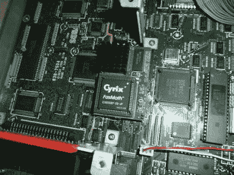

# 让世嘉 Teradrive 超速行驶

> 原文：<https://hackaday.com/2018/10/09/putting-the-sega-teradrive-into-overdrive/>

在 80 年代和 90 年代，似乎日本得到了电子游戏的所有好东西。在美国有被称为 NES、TurboGrafx-16 和创世纪的控制台。而在日本，它们有更酷的名字，如:Famicom、PC Engine 和 Mega Drive。后者被整合到大量不同的外形中，包括鲜为人知的 IBM PC/Mega Drive 组合 Sega Teradrive。在美国本土找到一台罕见的日本 20 世纪 90 年代个人电脑本身就是一项壮举，多亏了一位名叫[Ronnie]的电子爱好者，由于升级的 CPU 模块，至少有一台万亿次硬盘仍在强劲运行。

理论上，世嘉 tera drive T1 是一台造梦机器；结合了 IBM PC 的实用性和 Sega Mega Drive 的乐趣。双重功能扩展到支持 VGA 和复合视频的视频模式。然而，现实是最终的设计并不尽如人意。Teradrive 于 1991 年推出，采用英特尔 80286 16 位处理器，在当时已经落后两代处理器。可怜的 10Mhz 时钟速度在性能谱的低端，这意味着许多 DOS 游戏运行很差…或者根本不运行。

由于对这些规格不满意，[Ronnie]用一个包含 66Mhz 时钟的 Intel 80486 处理器的适配器板改装了他的 Teradrive。升级，伴随着主板的完全重新封顶，使 IBM PC 达到 486DX 状态。这开启了一些新的可能性，包括下面视频中的雷猫演示:

 [https://www.youtube.com/embed/Lfqag_OcgB4?version=3&rel=1&showsearch=0&showinfo=1&iv_load_policy=1&fs=1&hl=en-US&autohide=2&wmode=transparent](https://www.youtube.com/embed/Lfqag_OcgB4?version=3&rel=1&showsearch=0&showinfo=1&iv_load_policy=1&fs=1&hl=en-US&autohide=2&wmode=transparent)

[通过 [RetroRGB](http://retrorgb.com/sega-teradrive-cpu-upgrade.html)