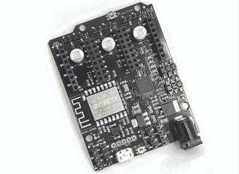

# PyBot 是一款面向大众的 3D 打印 SCARA 手臂

> 原文：<https://hackaday.com/2020/10/19/pybot-is-a-3d-printed-scara-arm-for-the-masses/>

我们都看过在装配线上工作的速度极快的 SCARA 手臂的视频，我们中的许多人都幻想过在家庭商店中拥有同样的技术。不幸的是，虽然 3D 打印机和示波器等产品的价格已经低于许多人十年前认为可能的价格，但高性能机器人对家庭玩家来说仍然过于昂贵。

当然，除非你愿意自己造。由[jjRobots]设计的 [PyBot 是一个开源机械臂](https://hackaday.io/project/175419-pybot-scara-robotic-arm-3d-printed-python)，它应该在普通硬件黑客的能力范围之内。有人可能会说，这是一个完全可能通过桌面 3D 打印实现的项目；因为不仅大多数结构部件是打印的，而且大多数机械元件都是常见的 3D 打印机部件。光滑的杆、直线轴承、丝杠和 NEMA 17 号发动机都非常便宜，这要感谢无数使用它们的 3D 打印机套件。

A custom control board keeps the wiring tight.

那些研究过类似项目的人可能会注意到，这个手臂的设计显然受到了[大多是印刷的 SCARA (MPSCARA)](https://www.thingiverse.com/thing:2487048) 的影响。但是，尽管该机器人被设计为携带挤压机并充当 3D 打印机，但[jjRobots]打算让 PyBot 更像一个通用平台。默认情况下，它有一个简单的抓手，但可以很容易地更换为任何工具或小工具。

在手臂的底部是一个定制的控制板，它结合了一个 Arduino M0，一个 ESP8266 和三个步进电机驱动器。但是如果您想从部件箱中构建自己的版本，您当然可以手动连接所有的主要组件。顾名思义，PyBot 是由运行在计算机上的 Python 工具控制的，因此让这个有能力的手臂执行您的命令应该相对容易。

这些年来，我们已经看到了一些令人印象深刻的 3D 打印机械臂，但 PyBot 的简单性尤其引人注目。这看起来像是你可以在一两个周末合理组装和编程的东西，[，然后在你的临时个人防护设备工厂投入工作。](https://hackaday.com/2020/04/12/clever-suction-for-robot-arm-automates-face-shield-production/)