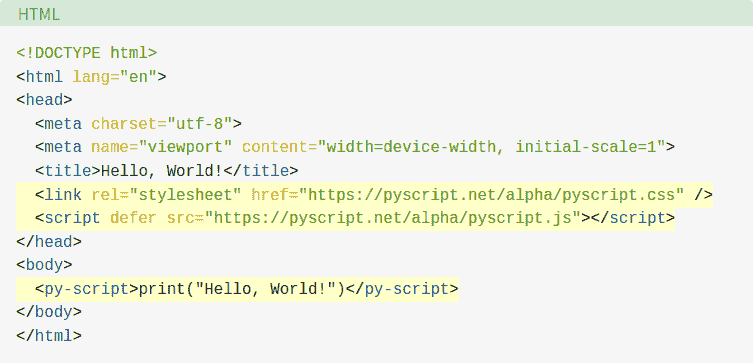

# PyScript:Web 浏览器中的 Python

> 原文：<https://hackaday.com/2022/06/08/pyscript-python-in-the-web-browser/>

电锯可以很快清理出后面的 40 个。也能拍出好看的恐怖片。因此，虽然有些人会说，我们不需要另一个工具来允许浏览器中更多的恶意脚本，但我们也知道，像任何工具一样，你可以使用它或滥用它。那个工具？ [PyScript](https://realpython.com/pyscript-python-in-browser/) ，当然是浏览器中的 Python。

该工具还处于早期试验阶段，因此该项目还不建议在生产环境中使用它。然而，如果它运行良好，前景不仅仅是您可以用 Python 编写基于浏览器的应用程序——您将有一种方便的方法来重用现有的 Python 代码，甚至能够在当前运行在服务器上的浏览器上运行相同的代码。这对于改进的客户机/服务器应用程序，或者在断开连接时希望能够在本地后端上运行，而在有连接时希望能够在远程后端上运行的情况，有着很大的影响。当然，您也可以与 JavaScript 进行互操作。

然而，真正的目标是让基于 web 的编程像 Scratch 或 JSFiddle 这样的编程系统一样易于初学者使用。因此，实际的项目与其说是一个软件，不如说是现有软件之间的集成。据帖子称:

> PyScript 是一个使用 Svelte 框架用 TypeScript 编写的单页应用程序(SPA ),使用 Tailwind CSS 样式，与 rollup.js 捆绑在一起。
> 
> 如果没有 Pyodide 的最新版本，PyScript 是不可能实现的，pyo dide 是一个用 emscripten 编译成 WebAssembly 的 CPython 解释器，使 Python 能够在浏览器中运行。PyScript 通过封装所需的样板代码，在 Pyodide 上提供了一个薄的抽象层，否则您必须使用 JavaScript 自己键入这些代码。

那么创建 PyScript 代码有多难呢？不太:

有趣的是，这不需要任何服务器设置。将文本保存到一个文件中，在浏览器中打开它，它就会运行。当然，没有为你设置服务器。据推测，这项工作是在 pyscript.net 服务器上完成的，这需要大量的设置！正如您所料，对于这种简单的东西，还需要一点加载时间，尤其是在第一次加载时。但是，您可以托管自己的服务器。

有些人会喜欢这样，有些人会讨厌这样。无论哪种方式，它都在这里，如果您必须在浏览器中编写脚本，您可能会比 Python 做得更差。我们仍然坚持使用 Fortran 的[，尽管也许我们应该](https://hackaday.com/2016/12/27/fortran-for-the-web/)[升级到第四代](https://hackaday.com/2018/08/02/web-pages-via-forth/)。