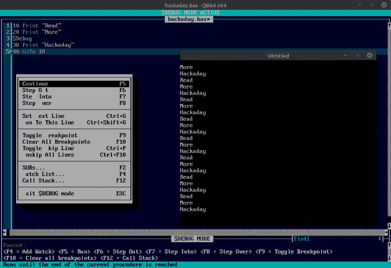

# QB64 推出 2.0 版本，获得增强的调试功能

> 原文：<https://hackaday.com/2021/10/17/qb64-hits-version-2-0-gets-enhanced-debugging/>

尽管名字如此，BASIC 并不完全是推荐给初学者的语言。技术在不断发展，现在如果你想尝试软件开发，大多数人会把你引向 Python。但是对于那些从一本计算机杂志上抄袭 BASIC 语言的人来说，这种语言仍然有着某种怀旧的吸引力。

如果这听起来像你，那么[我们可以衷心推荐 QB64](http://qb64.com) 。开放源码项目寻求使经典编程语言现代化，同时保持对 QBasic 4.5 的兼容性，QBasic 4.5 是 80 年代后期微软在 MS-DOS 中包含的基本环境。这种现代化不仅包括添加 OpenGL 等当代技术，还包括跨平台支持，让您可以在 Windows、Linux 和 Mac OS 上运行相同的代码。

The new debug mode in QB64 v2.

QB64 团队在几天前发布了 2.0 版本，如果您还没有尝试过，这是测试这个项目的最佳时机。changelog 包括针对每个受支持操作系统的平台特定改进，以及一长串常规修复和更新。但是可以说这个版本最大的特点是包含了`$Debug`元命令。

当代码中包含此命令时，IDE 将在编译后的程序中插入一个调试存根。在执行过程中，QB64 IDE 将切换到调试模式，并通过本地 TCP/IP 连接与您的程序实时通信。调试模式允许您逐行通过代码，检查变量的值，并设置断点。一旦你完成了对代码的修改，想要发布一个最终的二进制文件，你只需要删除那个`$Debug`命令，然后重新编译。

[我们过去曾讨论过使用 QB64 来复兴复古代码](https://hackaday.com/2018/02/22/quickbasic-lives-on-with-qb64/)，并认为该项目是新旧技术的完美融合。你永远不知道什么时候你可能[突然有一种冲动，想把你在 80 年代写的一些代码掸去灰尘](https://hackaday.com/2021/10/10/1981-called-heres-your-software/)，然后在那个时候还不存在的操作系统上运行。