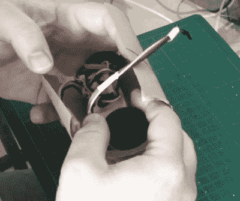

# 遥控卫生纸卷筒是我们应得的英雄

> 原文：<https://hackaday.com/2020/04/04/r-c-toilet-paper-roll-is-the-hero-we-deserve/>

出于大多数理性消费者无法理解的原因，相当一部分人认为，在现代史无前例的疫情，他们继续生存的关键是储备卫生纸。这使得我们这些人不会被迫根据我们内心的冲动行事，而更多的时候是看着纸制品通道上的空架子。

这使得它成为[【Ariel Yahni】开发他的遥控卫生纸卷筒](https://www.youtube.com/watch?v=5Ho04Y85Pbs)的最佳时机。随着这个小工具的部署，你可能有机会吸引卡伦远离所有的滚动黄金足够长的时间来抓住自己一包。即使它没有分散其他~~竞争者~~购物者的注意力，你至少可以享受当它匆匆而过时他们脸上的表情。

 这个项目首先从冰棒棍子开始。这些用来做一个加固的平台，上面安装了两个马达、无线电接收器、速度控制器和电池。通过一些巧妙的包装，[Ariel]能够将它(紧紧地)装入一个纸板管中，两个轮子的底部从切口中伸出来。然后用卫生纸仔细包裹，让它看起来像一个部分使用过的纸卷，包括一个在它身后飘动的拖尾。

在休息后的视频中，你可以看到[Ariel]带着他的电动 TP 穿过当地的一家商场进行试驾。我们很抱歉地说，在测试中没有人表现出疯狂跳水。但这可能是因为这段视频是在 12 月份录制的，当时人们还没有为争夺化妆品而争吵。这也解释了为什么他一开始能进商场。

想想看，如果我们有机会拥抱未来的高科技厕所，我们就可以避免这一切。就反乌托邦而言，这部正在变得相当怪异。

 [https://www.youtube.com/embed/5Ho04Y85Pbs?version=3&rel=1&showsearch=0&showinfo=1&iv_load_policy=1&fs=1&hl=en-US&autohide=2&wmode=transparent](https://www.youtube.com/embed/5Ho04Y85Pbs?version=3&rel=1&showsearch=0&showinfo=1&iv_load_policy=1&fs=1&hl=en-US&autohide=2&wmode=transparent)

