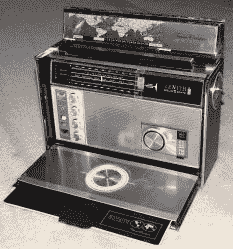
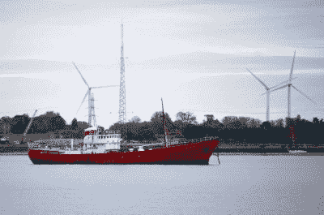

# 公海上的无线电盗版:对禁忌音乐的商业需求

> 原文：<https://hackaday.com/2019/04/24/radio-piracy-on-the-high-seas/>

海盗电台的真实故事是一场复杂的电波斗争。也许你脑海中会浮现出某个孩子在他妈妈的地下室里放唱片的画面，但我们所想到的盗版电台——卡罗琳电台和北海国际电台——是主要的商业运作。它们完全是普通的无线电台，只是它们在海上的船只上运作，以避免落入某个特定政府的管辖范围。

那时许多政府并不特别喜欢摇滚乐。人们想要它，因为人们想要，广告商想利用它。当人们想花钱但没钱时，企业家会找到一种方法来提供他们想要的东西。事情就是这样。

当然，如果只是这样，这就没什么意思了。但这个故事是一个与武装登船，求救电话中断音乐节目，和火灾爆炸阴谋之一。大多数广播电台不必处理这些事件。令人惊讶的是，至少有一个标志性的车站还在——至少在某种程度上是这样。

## 为什么是一艘船？

1964 年，罗南·奥拉希利认定摇滚乐在英国有市场。爱尔兰音乐人经理奥拉希利(O'Rahilly)很沮丧，因为他无法为自己代理的艺术家获得播放权。主要唱片公司控制着分配给政府批准的电台的有限数量的摇滚节目。他的解决办法是开办自己的广播电台。然而，在英国，只有政府——英国广播公司——被允许播放广播节目。英国直到 1973 年才向国内竞争者开放电波。如果 O'Rahily 只打算做短波，他可能会在任何地方开设一个电台，但第一次广播是在 AM 波段(1520 kHz)，所以发射机需要靠近目标观众。

解决办法是把发射机放在一艘船上，并把它放在靠近目标受众的国际水域。这不是一个新的想法。法律一出台，非法运营的电视台就如雨后春笋般涌现。Mercur 电台是已知的第一个公海广播电台，于 1958 年在丹麦沿海运作。甚至一些合法的广播公司——比如美国之音——早在 1952 年就用一艘船在东欧集团附近放置了发射机。他们停泊在希腊海岸，得到了希腊政府的许可。因此，尽管莫斯科对此事有所不满，但从技术上讲，他们并不是海盗。

然而，英国的情况更加复杂。当时，政府要求收取无线电接收机的执照费。该许可证的一部分禁止被许可人收听未经授权的——嗯，也许是未经授权的，因为是英语——广播。因此，从理论上讲，仅仅是收听另一个国家的电台，比如广受欢迎的卢森堡电台，在技术上是违法的。这实际上是不可行的。顺便说一句，收音机许可证在 1971 年就到期了，但是今天电视机仍然需要许可证。

奥拉希利并不是唯一一个注意到公众需求和广播垄断之间差距的人。亚特兰大广播电台正努力击败奥拉希利，成为第一家广播电台。

## 那些船

奥拉希利接受了六个投资者，买下了一艘 702 吨的载客渡轮“弗雷德里克西亚号”。它被安装用于无线电服务，改名为 MV Caroline，并于 1964 年停泊在费利克斯托开始广播。亚特兰大项目正在制作 MV《我的朋友》。然而，两家合资企业合并了，Mi Amigo 号开始作为南卡罗琳电台广播，而卡罗琳号成为北卡罗琳电台，并转移到马恩岛附近的水域。这使得它覆盖了英国的大部分地区。这两个电台有时播放同样的预先录制的节目。

卡罗琳电台的听众人数很快突破了 1000 万。在与亚特兰大计划合并后，卡罗琳南方广播电台的观众被伦敦广播电台抢走了，伦敦广播电台是得克萨斯人唐·皮尔森在了解了卡罗琳广播电台和亚特兰大后创办的另一家海盗电台。伦敦电台是由前美国海军扫雷舰 MV 银河号操作的。你可以看一部电影短片，大概是一个摄制组参观下面的卡罗琳的时候。

 [https://www.youtube.com/embed/J4Ue24jNrwM?version=3&rel=1&showsearch=0&showinfo=1&iv_load_policy=1&fs=1&hl=en-US&autohide=2&wmode=transparent](https://www.youtube.com/embed/J4Ue24jNrwM?version=3&rel=1&showsearch=0&showinfo=1&iv_load_policy=1&fs=1&hl=en-US&autohide=2&wmode=transparent)

卡罗琳与亚特兰大的合并使得奥拉希利有了一位联合导演艾伦·克劳福德。奥拉希里买断了克劳福德的股份，并着手重新赢得伦敦电台的听众。功率的增加和频率的改变成功了，卡罗琳的观众超过了 2300 万。

一年后，当电影摄影机到来时，毫无疑问，《卡罗琳电台》是成功的。你可以看到下面的视频，奇怪的是它让我们想起了披头士的一部电影。

 [https://www.youtube.com/embed/rcsvRqUsiHE?version=3&rel=1&showsearch=0&showinfo=1&iv_load_policy=1&fs=1&hl=en-US&autohide=2&wmode=transparent](https://www.youtube.com/embed/rcsvRqUsiHE?version=3&rel=1&showsearch=0&showinfo=1&iv_load_policy=1&fs=1&hl=en-US&autohide=2&wmode=transparent)

## 海盗暴力

到目前为止，这个故事听起来就像一些轻微的可疑的商业交易。然而，一个海盗电台，无线电城，在肯特海岸的一个海上堡垒中运作，引起了第一个真正的法律问题。卡罗琳电台希望收购城市电台，卡罗琳的一位董事奥利弗·史沫特莱与城市电台的雷金纳德·卡尔弗特达成协议，升级电台的发射机。然而，发报机坏了，交易失败了。史沫特莱派了十个人去找发报机。卡尔弗特来到史沫特莱的家，要求他们离开。随后发生了暴力冲突，卡尔弗特中弹身亡。

起初，史沫特莱被指控犯有谋杀罪，但这最终被减为过失杀人罪，在审判中，陪审团宣告他无罪。

## 政治

1967 年，英国规定向非法盗版广播公司提供或购买广告是非法的。列举的理由包括干扰其他船只，不向唱片公司支付版税，以及违反国际协议。

这项法律关闭了至少两家电台，伦敦电台和 270 电台。卡罗琳电台刚刚将他们的供应业务转移到荷兰，而荷兰直到 1974 年才通过了禁止与盗版广播商进行商业往来的法律。

不过，该法律还有另外两个影响。卡罗琳电台开始被卡罗琳国际电台取代。此外，英国广播公司雇用了伦敦电台的大部分 DJ，并开办了英国广播公司第一电台，其形式与伦敦电台相似。

## 受到攻击

卡罗琳电台从荷兰获得补给，但他们显然无法支付一些账单。1968 年初，由于没有付款，这些船被登船并被拖到荷兰，导致该站陷入沉默。几乎在同一时间，一些大型船载发射机覆盖不到的陆基海盗电台开始使用卡罗琳电台的名字。

然而，真正的戏剧发生在另一个海盗电台:北海国际广播电台(RNI)。RNI 开始是试图利用银河号(旧的伦敦电台船)开办另一个电台。该项目没有成功，但它导致了 Mebo II 的建造，该船于 1970 年停泊在克拉克顿附近的国际水域。她可以同时用四种不同的频率广播，包括调频和短波。这些巨大的发射机功率可达 105 千瓦，但通常在 60 千瓦左右。你可以在下面看到一篇 1970 年关于 RNI 的新闻报道。

 [https://www.youtube.com/embed/J4Iq-oe7DVs?version=3&rel=1&showsearch=0&showinfo=1&iv_load_policy=1&fs=1&hl=en-US&autohide=2&wmode=transparent](https://www.youtube.com/embed/J4Iq-oe7DVs?version=3&rel=1&showsearch=0&showinfo=1&iv_load_policy=1&fs=1&hl=en-US&autohide=2&wmode=transparent)

1970 年大选期间，当时由工党控制的英国政府开始干扰 RNI。RNI 短暂地将他们的名字改成了卡罗琳国际广播电台(在奥拉希利的支持下)，并为支持商业电台的保守党发起了一场轰轰烈烈的政治运动。选举后，RNI 改回了它的名字，但干扰仍在继续。有一些影射说 RNI 在向东德广播加密信息，尽管这还远不能确定。

但直到 1970 年后期，攻击才超越了电子领域。与一个名叫曼德斯的夜总会老板的交易失败了，非常糟糕。目前还不清楚到底是什么原因造成的，但曼德斯带着一艘拖船出现了。他在一艘汽艇上接近 Mebo II，据报道，他带着一名妇女和一名儿童去阻止攻击。

电台的 DJ 在节目中休息，报告他们受到攻击，并要求听众打电话到他们的总部报告。记住，1970 年没有卫星电话。拖船威胁要向天线喷水，直到 Mebo II 船员告诉他们这会电死拖船上的所有人。这似乎不太可能，但确实阻止了他们去尝试。最终，拖船离开了，但一艘荷兰海军护卫舰来到了旁边。

## 五月天！

维罗妮卡电台，另一个在荷兰很受欢迎的海外电台，担心所有这些戏剧会导致荷兰政府关闭他们。他们的解决方案是付给 RNI 10 万英镑，让他关门大吉。那次交易持续了四个月，然后 RNI 恢复了英语和荷兰语交易。但这还不是 RNI 所有的戏剧。

你有没有在听音乐，DJ 停歌打五月天的时候？我也没有。但如果你在听 RNI 的话，这就是 1971 年 5 月 15 日发生的事情。一艘小船靠近 Mebo II 号，投下一枚炸弹，引起一场大火。

 [https://www.youtube.com/embed/M1A2D-gvhBc?version=3&rel=1&showsearch=0&showinfo=1&iv_load_policy=1&fs=1&hl=en-US&autohide=2&wmode=transparent](https://www.youtube.com/embed/M1A2D-gvhBc?version=3&rel=1&showsearch=0&showinfo=1&iv_load_policy=1&fs=1&hl=en-US&autohide=2&wmode=transparent)

Mebo II 在一夜之间被废弃，需要在海上维修。三名与爆炸案有关的男子在阿姆斯特丹被捕，随后两名与维罗妮卡电台有关的人被捕。显然，维罗妮卡电台花钱迫使 Mebo II 号离开国际水域，在那里船员可能被逮捕，船只可能被债权人扣押。这导致了肇事者一年的监禁，以及一项禁止从荷兰供应海盗无线电船的法律。

RNI 在 1974 年的大部分时间里都在运作，但最终还是永远停播了。这些船最终被卖给了利比亚，他们在那里继续广播，直到 20 世纪 80 年代，利比亚海军击沉了他们进行打靶练习。

## 今日卡罗琳电台

 那么，海盗电台真的就此终结了吗？不完全是。卡洛琳电台今天作为[互联网流](http://www.radiocaroline.co.uk)幸存下来，他们已经涉足卫星广播。你可以在他们的网站上阅读他们版本的历史。2017 年，卡罗琳电台获得了真正的 AM 电台执照。如果你离得不够近，无法用晶体管收音机接收到布拉德韦尔的声音，总会有[收音机花园](https://radio.garden/listen/radio-caroline-am-648/FS0hxvBq)。

相邻的照片显示了 MV 罗斯复仇，卡罗琳电台的后期船只之一，仍然作为一个海盗电台博物馆，广播工作室，偶尔低功率长波发射机。

目前也有一个 RNI 的网站，尽管看起来它实际上只是由加里·斯蒂文斯在 2008 年创建的一个致敬网站。截至 2016 年，该站现由中国张勇运营。你可以通过流媒体收听，显然在世界的某些地方可以通过 AM 和 FM 收听。如果你对舰载电台感兴趣，你可以在[广播舰队](http://broadcasting-fleet.com/)网站上找到全面的治疗方法。甚至包括合法船舶。

### 照片致谢:

*   跨洋电台-【乔·豪普特】[知识共享](https://creativecommons.org/licenses/by-sa/2.0)
*   罗斯复仇:[格林·贝克] [知识共享](http://creativecommons.org/licenses/by-sa/2.0/)