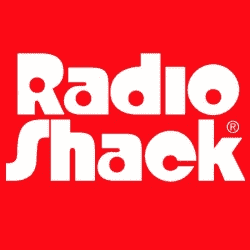

# RadioShack 将重生为在线第一零售商

> 原文：<https://hackaday.com/2020/11/19/radioshack-to-be-reborn-as-online-first-retailer/>

好消息是，截至今日 [RadioShack 已被零售电子商务风险投资公司(REV)](https://www.businesswire.com/news/home/20201119005153/en/Retail-Ecommerce-Ventures-REV-Acquires-RadioShack-Brands) 正式收购，这让这家陷入困境的公司重获新生。不利的一面是，至少对我们这样的人来说，目前还没有计划让这家标志性的电子产品零售商回归其实体根基。顾名思义，REV 专注于网上零售，之前曾改造过 Pier 1 Imports 和 Dressbarn 等其他破产企业的互联网业务。

 虽然新闻稿没有完全排除新的实体 RadioShack 地点的可能性，但很明显，REV 认为零售的未来不会出现在你当地的购物中心。随着美国考虑进一步封锁，以回应持续的新冠肺炎疫情，很难不同意。将会有数百万无聊的孩子和成年人在漫长的冬夜中寻找事情做，一两个送货上门的电子套件可能正是他们想要的。

REV 表示，他们计划在 2021 年公司成立 100 周年之际重新推出已经过时的 RadioShack 网站。截至本文撰写之时，该网站目前表示，销售已暂时停止，以进行库存重组，但尚不清楚这是否与收购直接相关。在 2017 年[关闭了大部分实体店铺](https://hackaday.com/2017/06/24/a-goldmine-of-radio-shack-goodies-is-up-for-auction/)后，准确统计公司手头还有多少商品，听起来肯定是新老板想要做的事情。

像你们大多数人一样，我们对 RadioShack 的黄金时代有着美好的回忆，那是在他们认为卖手机和电视是个好主意之前。值得称赞的是，他们确实试图通过[询问社区他们想在商店里看到什么来重新点燃他们与黑客和制造商的关系](https://hackaday.com/2011/05/27/speak-your-mind-and-help-radioshack-suck-less/)。但我们都知道故事的结局。虽然这个消息看起来不会让我们更接近拥有一个库存电阻器的社区商店，但知道下一代仍将拥有 [RadioShack 套件和书籍还是会让人感到些许安慰。](https://hackaday.com/2017/01/18/forrest-mims-radio-shack-and-the-notebooks-that-launched-a-thousand-careers/)