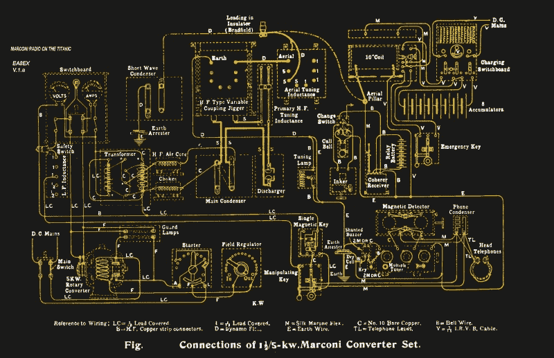
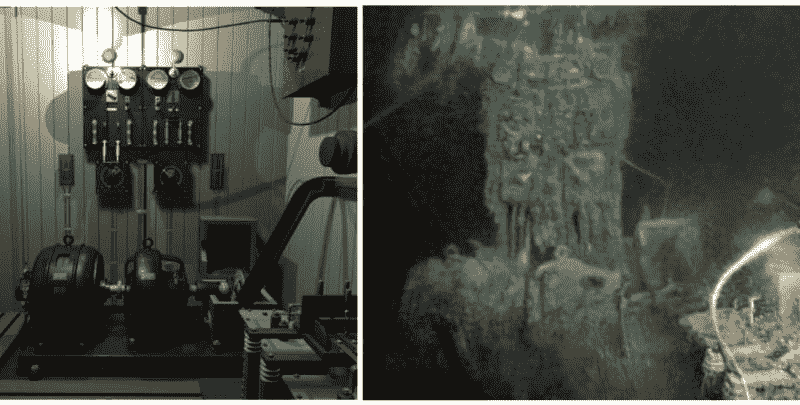

# 升起泰坦尼克号的无线电室

> 原文：<https://hackaday.com/2020/03/04/raising-the-titanics-radio-room/>

出于某种原因，在所有航行于海洋的船只中，最能激发我们想象力的是那些不幸的船只。很少有船只像 RMS *Titanic* 号这样不幸，在 1912 年 4 月 15 日的夜晚，在处女航中撞上冰山后沉没，也没有哪艘船像她一样受到如此广泛的关注。

在她短暂的一生中，泰坦尼克号不仅是水上最优雅的船，也是技术最先进的船。她夸耀自己拥有最新的推进和导航技术，以及一项最近才出现的创新:一个马可尼无线电室，用于船对岸和船对船的通信。

泰坦尼克号的无线电室随着巨轮的船头部分降落在海底。2.5 英里的慢动作自由落体破坏了房间的结构，但齿轮相对完整地幸存了下来。现在，一个多世纪过去了，[正在努力挽救那个齿轮](https://www.washingtonpost.com/history/2020/01/21/titanic-treaty-salvage-expedition/)，着眼于可能恢复它的工作状态。当然，这是一个有争议的计划，但它在技术上很吸引人，值得看看那里有什么，以及为什么我们在这么多年后还要费心。

## 无线即服务

当泰坦尼克号的龙骨在 1909 年铺设时，商业无线电还处于萌芽状态。无线电报和信号公司，俗称马可尼公司，以其创始人古列尔莫·马可尼命名，主要为海上船只提供无线电报服务。那时它只经营了 12 年，而且从 1903 年开始在远洋客轮上安装“马可尼房间”。在马可尼之前，一旦一艘船看不见陆地，它就像不存在一样。无线电改变了这一切，能够发送求救信号的救生潜力被航运公司用来证明在船上增加马可尼系统的费用是合理的。

然而实际上，在将无线电报纳入远洋客轮的设计中，海上生命安全是次要考虑因素。马可尼公司是一家商业企业，因此需要尽可能将他们的服务货币化。向其他船只来回发送消息或使用该系统联系岸上的运输代理安排停泊是重要的用例，但利润并不丰厚。然而，迎合富有乘客的奇思妙想，许多人希望通过从大西洋中部发送“Marconigram”来炫耀他们的财富，这是非常有利可图的。前 10 个单词花费 12 先令 6 便士，相当于 2017 年的 63 美元。

*Titanic*‘s Marconi radio. Source: [The Telegraph Room](http://www.telegraph-office.com/tel_off-page.html)

事实证明，马可尼服务非常受欢迎，以至于在横渡大西洋的前 36 个小时里，泰坦尼克号的两位无线电报务员哈罗德·布赖德和杰克·菲利普斯向马可尼网络中的海岸电台发送了大约 250 份马可尼电报。这两名分别为 22 岁和 24 岁的年轻人长时间工作以满足需求，更糟糕的是，在碰撞发生的前一天，全新的无线电设备出现了故障，这是在出航前一周才安装的。这两人彻夜未眠诊断和修复问题，这违反了马可尼公司的政策，但表现出了对雇主的极大奉献精神。

## 技术发展水平

泰坦尼克号上的马可尼套房相对宽敞。它由三个房间组成:操作员的主房间，一个有隔音墙的“无声房间”,用来放置响亮的火花隙无线电设备，以及一个供马可尼操作员使用的小铺位。套房位于船甲板上，在桥和一级入口的大楼梯之间。它的位置尽可能地靠近船的顶部，以保持到天线的馈线尽可能地短。

无线电装置由一个电动发电机组成，它将船上的 DC 电源提升到高压交流电，为同步旋转火花隙发射机提供动力。5 千瓦的发射机是海上功率最大的，能够从大西洋中部到达纽约或伦敦。国际公约要求使用 600 米波段进行船岸通信，300 米波段进行船对船工作。

Left is a CG render of the Marconi room on *Titanic*, compared on the right to its current state. Source: [r/Titanic](https://www.reddit.com/r/titanic/comments/es5d3n/titanics_wireless_equipment/); render appears to be the work of Parks Stephenson, underwater shot appears to be a screengrab from a James Cameron expedition.

## 难忘的一夜

从 4 月 14 日开始，纽芬兰附近海域的船只开始发现冰山。按照惯例，装有无线电的船只会广播浮山的警告，以警告其他船只前方的危险。泰坦尼克号的马可尼操作员收到了至少六条警告冰山的信息。这些信息中的前两条被转发给爱德华·史密斯上尉；然而，最后四个从未引起他的注意。据推测，Bride 和 Phillips 忙于维修停电造成的 Marconigrams 积压，他们从未将消息转发到桥上。这得到了 Bride 对来自党卫军*加州人*的最后警告的回应的支持:“闭嘴，我在开普种族工作，”指的是纽芬兰南端的马可尼中继站。最后的警告是在船上时间 23:30 收到的，距离*号泰坦尼克号*的死亡打击只有 9 分钟。

Jack Phillips and Harold Bride. Source: [Amateur Radio from Scotland](http://www.amateurradio.eu/gm/silent-keys/harold-bride-titanic.htm)

无论 Bride 和 Phillips 对他们雇主的业务的尊重在造成灾难中扮演了什么角色，他们对灾难的反应和他们的设备的原始力量以及他们作为电报员的技能弥补了这一点。如果没有无线，毫无疑问，生命的损失会更大。泰坦尼克号在它最终沉入海底的两个半小时里，几乎一直在直播，Bride 后来作证说，当他们听到水从马可尼套房外面的甲板上流过时，Phillips 还在发信号。在船头滑入最后一艘救生艇之前，新娘和菲利普斯都成功进入了寒冷的北大西洋；新娘幸免于难，只受了点轻伤，但菲利普斯在漫长的等待 RMS *卡帕西亚*号响应他自己几个小时前发出的求救信号的过程中暴露在外而死。那晚获救的 705 条生命之所以获救，是因为他们坚守岗位，尽管被史密斯上尉解除了职务。

## 这不是一艘船。这是一座坟墓

泰坦尼克号的秘密，以及她的尸体，在大西洋底下隐藏了将近四分之三个世纪。一旦罗伯特·巴拉德在 1985 年发现了沉船，它就在集体想象中激起了一些东西，并催生了整个泰坦尼卡产业。随后对沉船的探索已经非常详细地绘制出了船上每一英寸的位置和每一件文物的位置，多年来，遥控潜水器(ROVs)已经找到了多件物品。

马可尼套房位于船的顶部是偶然的，因为这艘巨轮的船头部分基本上以垂直的位置沉入海底。这使得打捞齿轮，可以在下面的视频中看到，在技术上是可能的。总部位于亚特兰大的 RMS Titanic，Inc .公司拥有打捞沉船的唯一权利，最近在弗吉尼亚州的美国地方法院获得许可，可以“手术取出和取回”泰坦尼克号上的马可尼装置。

 [https://www.youtube.com/embed/sVP_Aqgbcik?version=3&rel=1&showsearch=0&showinfo=1&iv_load_policy=1&fs=1&hl=en-US&autohide=2&start=1840&wmode=transparent](https://www.youtube.com/embed/sVP_Aqgbcik?version=3&rel=1&showsearch=0&showinfo=1&iv_load_policy=1&fs=1&hl=en-US&autohide=2&start=1840&wmode=transparent)

沉船受到美国和英国之间的一项条约的保护，该条约迄今为止仅限于打捞沉船周围碎片区的物品。收音机的回收将需要切除套房屋顶的一部分，这将标志着沉船首次被掠夺其宝藏。提出的论点是明智的；这艘船不断恶化的结构将很快导致完全崩溃，将马可尼齿轮埋在数吨腐蚀的金属下，使其消失在时代的长河中。其他人认为这将是一种盗墓行为，是对那个灾难性夜晚的 1527 名受害者最后安息之地的亵渎。

不管你的立场是什么，很难否认，找到这样一件重要的艺术品，一件既耗费了如此多的生命又拯救了如此多的生命的艺术品，是一个诱人的想法，而且看着它展开应该会非常有趣。