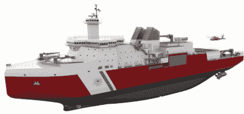

# 稀有二极管威胁海岸警卫队的北极野心

> 原文：<https://hackaday.com/2021/03/14/rare-diode-threatens-coast-guards-arctic-ambitions/>

美国海岸警卫队重型破冰船*北极星*实际上是一艘独一无二的船。在它的姊妹船*极地海洋*于 2010 年被停用后，它成为舰队中最强大的破冰船，也是仅有的两艘能够在危险的极地地区作业的美国破冰船之一。这艘船对于保护美国在北极[的科学和经济利益至关重要，但是根据*商业内幕*](https://www.businessinsider.com/coast-guard-icebreaker-polar-star-running-out-of-spare-parts-2021-3) 最近的一篇文章，这艘船的年龄和备件的稀缺使得这项已经很困难的任务变得更加困难。

在这篇文章中，威廉·沃伊特拉船长特别提到，该船的柴油电力推进系统运行时间过长，因为其交流/DC 整流器中使用的二极管已经不再生产。由于海岸警卫队的库存中没有剩余的备件，船员们不得不转向易贝寻找尽可能多的备件。但是一旦他们的储备耗尽，Woityra 船长担心他的船会沉入水中:

> 我们在架子上的一个盒子里有几十个这样的东西，当它们没有了，船就不能再运行了。这真的有点令人不安…这艘船，这次行动，以及美国在北极的破冰行动都依赖于一箱备件，而现在已经没有了。"

这艘有 45 年历史的船在 2013 年接受了 6000 万美元的整修，但预计这只能将这艘辛勤工作的船的寿命延长 8 到 10 年。有人提议进行一次更彻底的检修，这可能会让北极星号服役到 2040 年；但是由于估计成本为 4 亿美元，国会决定采用更经济的权宜改装。

Polar Security Cutter

就在几天前，美国空军宣布正在寻找一些优秀的黑客来帮助对老化的 B-2 轰炸机群中的组件进行逆向工程。很像*北极星的*老式整流二极管，隐形飞机的零部件越来越难找到。

虽然空军在预算中有足够的资金来进行更换，但海岸警卫队只能希望他们的二极管库存能坚持多一点时间。国会已经批准了极地安全切割计划，这是一支下一代破冰船舰队，旨在与俄罗斯和中国的新型船只相媲美。这些船中的第一艘可能在 2024 年启航，为北极星提供一些急需的支持。

【感谢 Chuckz 的提示。]