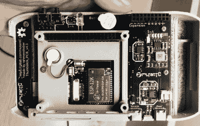

# 树莓派和 ESP32-S2 联手打造 MutantC_V4

> 原文：<https://hackaday.com/2021/08/30/raspberry-pi-and-esp32-s2-team-up-for-mutantc_v4/>

回到 2019 年，我们第一次看到 mutantC，这是一款由[rahmanshaber]创建的开源 3D 可打印 Raspberry Pi 手持设备，它从 21 世纪初索尼的 VAIO 超移动电脑(UMPCs)中获得了不少灵感。这是令人印象深刻的第一次尝试，但在真正成为实用的移动设备之前，显然还有很长的路要走。

经过两年的开发和三个迭代版本的 Linux QWERTY 滑块， [[rahmanshaber]准备展示新的和改进的 mutantC_v4](https://mutantc.gitlab.io/mutantC_V4.html) 。从外表上看，它与最初的版本非常相似，值得注意的是，它增加了一个微型拇指棒和右侧的一对可编程按钮，除了触摸屏外，还可以用于输入。但里面却是另外一个故事，有如此多的变化和改进，我们甚至不知道从哪里开始。

Inside the mutantC_v4, showing off the ESP32-S2

可能最显著的改进是[在主 PCB 上增加了一个 ESP32-S2](https://hackaday.com/2020/03/23/esp32-s2-samples-show-up/) ，特别是一个裸露的 ESP-12K 模块。以前版本的硬件使用 Arduino Pro Micro 与所有硬件接口，但 ESP32 增加的马力应该可以方便地与[rahmanshaber]分配给芯片的传感器、控件和新像素阵列配合使用。甚至还有一个蜂鸣器和一个硬币式振动马达，为用户提供一些反馈。虽然主板发生了重大变化，但它仍然保持与 Pi、2、3 和 4 的兼容性。

另一个值得注意的增加是手持设备底部的扩展连接器，它具有 I2C、UART 和 3.3 V 的引脚。在下面的视频中，[rahmanshaber]提到，该功能以前是通过标准的 2×6 母接头块实现的，但现在使用了更细的母 USB-C 端口。我们确实想知道，如果将这个假 USB 端口放在实际上用于为系统充电的真正 USB 端口旁边，会不会有点混乱，但是在这样拥挤的地方，偶尔你必须做出这样一些艰难的决定。

看到[rahmanshaber]自从发布 mutantC 的第一个版本以来如何磨练自己的技能，真是令人鼓舞。3D 打印部件和 PCB 在过去两年中已经相当成熟，显示出一个专注的爱好者可以多么迅速地提高他们的能力。最新版本的[已经进入 2021 年黑客大奖](https://hackaday.io/project/181347-mutantc-v4-easy-to-build-modular-handheld-pc)。但这场秀还没有结束，因为我们听说这款令人印象深刻的手持设备的 v5 可能会处理[树莓 Pi 4 计算模块](https://hackaday.com/2020/10/19/new-raspberry-pi-4-compute-module-so-long-so-dimm-hello-pcie/)。

 [https://www.youtube.com/embed/BESuyftW3oY?version=3&rel=1&showsearch=0&showinfo=1&iv_load_policy=1&fs=1&hl=en-US&autohide=2&wmode=transparent](https://www.youtube.com/embed/BESuyftW3oY?version=3&rel=1&showsearch=0&showinfo=1&iv_load_policy=1&fs=1&hl=en-US&autohide=2&wmode=transparent)

