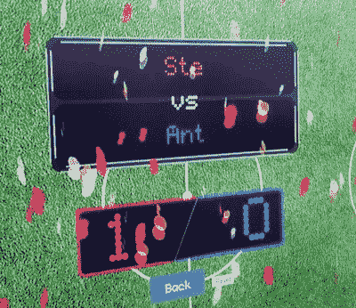

# 树莓 pi 足球记分牌

> 原文：<https://hackaday.com/2018/08/13/raspberry-pi-foosball-scoreboard/>

桌上足球，也称为桌上足球，是 20 世纪 20 年代的经典游戏，完全没有现代游戏的花哨功能。玩家用最简单的输入设备控制坚忍的小人，以便在运动场上来回移动一个小球。因此，很自然地，有人认为他们应该添加一个树莓皮，并把整个事情拖到 21 世纪。

【Matmi】的团队大部分休息时间都挤在桌上足球桌旁，但他们发现这种体验对观众来说远不如玩家来的刺激。为了给他们的会议增添一点华丽，他们增加了一个华丽的展示，不仅显示当前的分数，而且通过展示一些庆祝的纸屑让个人分数更令人兴奋。

安装在球台回球管上的微型开关让树莓 Pi 知道谁得分了，什么时候得分的。这些信息被用 Vue.js 编写的基于网络的记分牌获取，并由 nginx 提供。实际的记分牌是由通过 Wi-Fi 连接到 Pi 的笔记本电脑显示的。

如果软件设置看起来有点复杂，那是因为项目本身是 HTML5 和一般 web 编程的学习经历。进一步的更新计划是精简系统，使其更加独立，并为记分牌添加更多功能，如锦标赛和随机比赛。

有趣的是，这些年来我们已经看到了相当多的桌面足球黑客。这些桌子似乎在办公室和黑客空间里无处不在。从[将它变成在线体验](https://hackaday.com/2014/08/26/foosball-now-part-of-the-internet-of-things/)到建造一个可以与对战的[人工智能桌子，有很多方法可以给这个近 100 年历史的游戏注入一些新的生命。](https://hackaday.com/2014/02/25/robot-foosball-will-kick-your-butt-if-you-play-slowly/)

[https://player.vimeo.com/video/281970365](https://player.vimeo.com/video/281970365)