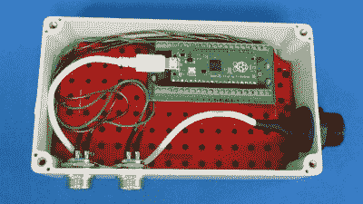

# Raspberry Pi Pico 有助于快速输入设备

> 原文：<https://hackaday.com/2021/09/29/raspberry-pi-pico-makes-for-expeditious-input-device/>

凭借其丰富的 GPIO 引脚和本机 USB，Raspberry Pi Pico 可以说是开发您自己的平台无关 USB 人类输入设备的理想微控制器。但你不必相信我们的话。看看 4 美元的电路板让[【阿尔贝托·努内斯】为他的电脑](https://hackaday.io/project/181821-usb-pedal-based-on-rpi-pico)组装一对脚踏板有多快。

Wiring doesn’t get much easier than this.

窥视一下外壳内部会发现……嗯，不是全部。所有隐藏在那个重型塑料盒里的是 Pi Pico 和一些拧紧端子，让[Alberto]轻松地为踏板本身连接母隔板连接器。顺便提一下，虽然你当然可以自己制作踏板，但这个项目使用的踏板似乎是我们在类似项目中看到的那种[市售的踏板。](https://hackaday.com/2021/05/27/this-esp32-bluetooth-page-turner-cant-get-any-easier/)

硬件解决后，[Alberto]只需要编写软件。虽然他可以采取简单的方法，硬编码所有内容，但我们欣赏他的 CircuitPython 脚本从文本文件加载配置。这使您可以轻松地配置哪些 GPIO 引脚连接到按钮，以及将它们与哪些键码相关联。他真的不需要为了自己的目的而经历这么多的努力，但是这使得这个项目更容易适应其他人，所以我们向他致敬。

如果你正在寻找更多的灵感，我们自己的[【Kristina Panos】组装了一个 Python 驱动的宏脚凳](https://hackaday.com/2019/12/20/macro-foot-stool-helps-me-get-a-leg-up-on-work/)，你可以把它放在你的桌子下面，用作快速键盘快捷键。另外，如果需要的话，你可以站在上面够到顶层的架子。