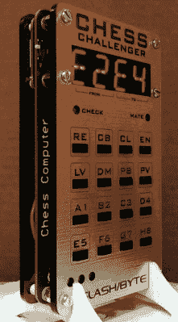

# 树莓 Pi 为这台复古象棋电脑提供动力

> 原文：<https://hackaday.com/2019/01/06/raspberry-pi-powers-this-retro-chess-computer/>

如果你想象有人在和电脑下棋，你可能会想象他们盯着显示器沉思，手里拿着鼠标，准备将他们的数字棋子拖入游戏。对于那些在休息时间偶尔玩玩象棋的人来说，这可能是准确的，但对于真正的象棋爱好者来说，没有什么比用真正的棋子在真正的棋盘上玩更好的了。当然，棘手的部分是向你电脑上的一个软件解释整个物质世界。

 通过【斜线/字节】输入“象棋挑战者”。他的复古主题开放式硬件设计[模仿了 1978 年的同名商业小工具，利用树莓派零和现代国际象棋软件将复古概念带入 21 世纪](https://github.com/slashbyte/ChessComputer)。有了国际象棋挑战者和一个标准的棋盘，玩家可以面对一场与计算机的史诗般的斗智斗勇，而没有患腕管综合症的风险。虽然我们不能保证少数几块板不会因为沮丧而翻转过来。

这款袖珍象棋电脑采用了“三明治”式的结构，既展示了内部结构，又能合理地保护物品。所有电子设备都位于中央定制 PCB 上，该 PCB 具有用于双 LTP-3784 e“star burst”LED 显示器的 HT16K33 驱动器、MCP1642B 稳压器、用于键盘的 16 个 TL3305 触摸开关以及用于为整个演出供电的 3.7 伏锂离子电池的 MCP73871 电池管理芯片。Pi Zero 本身通过 GPIO 接头连接到电路板，并由用于将器件固定在一起的支架提供机械支撑。

在软件方面，Pi 运行成熟的 Stockfish 开源象棋引擎。经过十多年的开发，这个 GPL 许可包旨在为从智能手机到桌面电脑的所有设备提供世界级的国际象棋游戏，并且[我们已经看到它在过去几年中出现在许多项目中](https://hackaday.com/2018/04/19/play-chess-against-a-ghost/)。[slash/byte]为 Raspberry Pi 提供了准备好的闪存 SD 卡映像，甚至提供了详细的安装和设置说明，指导您完成一些更棘手的设置，例如让 Pi 从只读操作系统运行，以便突然断电不会破坏文件系统。

多年来，[我们见过的一些最令人印象深刻的项目](https://hackaday.com/2017/09/26/chess-robots-got-the-moves/)都是围绕下棋展开的，而[slash/byte]的这个最新项目也不例外。另一个例子的长度国际象棋社区将去完善游戏的国王。

 [https://www.youtube.com/embed/dNcgx6-hAMY?version=3&rel=1&showsearch=0&showinfo=1&iv_load_policy=1&fs=1&hl=en-US&autohide=2&wmode=transparent](https://www.youtube.com/embed/dNcgx6-hAMY?version=3&rel=1&showsearch=0&showinfo=1&iv_load_policy=1&fs=1&hl=en-US&autohide=2&wmode=transparent)

