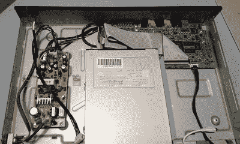

# 树莓 Pi 复兴独立 DivX 播放器

> 原文：<https://hackaday.com/2019/02/22/raspberry-pi-revives-stand-alone-divx-player/>

对于我们的新面孔读者来说，这可能看起来有点滑稽，但曾经有一段时间，你可以去一家大型零售商那里购买所谓的“DivX 播放器”。虽然它们有普通 DVD 播放器的外观，但这些小玩意可以从 CD-R 或 DVD-R 上读取各种数字视频文件格式，并配有基本的文件浏览器。根据你能忍受的视频压缩量，像这样的播放器可以让你将一整季的节目或多部电影打包到一张光盘上。在我们开始把所有东西都放到网上之前，这是一件大事。

Room to grow.

[Roberto Piva]在 2003 年左右得到了一台早期的数字媒体播放器 KiSS DP-500，[认为它太独特了，不能送到回收中心](https://civitz.github.io/2019/02/17/upcycle-kiss-dp500-with-rpi3-2.html)。他不仅对它的工作原理感到好奇，还认为尝试将它转换成 Raspberry Pi 驱动的流媒体播放器会很有趣。有人可能会说，拿走这些设备中的一个，然后把它装满了当初让它过时的相同技术，这几乎是有悖常理的，但我们有什么资格去评判呢？

打开老式机顶盒后，[Roberto]立即被里面的空空如也震惊了。他得到的印象是，该设备是一项紧急工作，是为了利用一个相对短暂的趋势而推出的。看着它，我们不得不同意。这几乎就像他们在某个地方的仓库里买了一些旧的录像机底盘，并决定在里面安装一些(当时的)现代电子设备。它甚至使用看起来像标准 IDE 光驱的东西，而不是专门构建的东西。

[Roberto]希望他可以接入播放器的原始电源，但经过测试发现，它无法可靠地运行现代 Pi。因此，他将一个通电的 USB 集线器放入这个洞穴状的外壳中，连接到播放器前面板上原来的电源开关上。最初的 PSU 无法处理 Pi，但它确实可以很好地旋转他用拉链安装在光驱顶部的 IDE 硬盘。

这足以获得一个漂亮的 Kodi 机顶盒，能够从互联网或内部硬盘驱动器上下载媒体，但[Roberto]对未来有更多的计划。他想尝试通过 USB 到 IDE 适配器让光驱工作，这样设备就可以完整地循环播放充满视频文件的刻录光盘，并提到他想反向工程前面板和红外接收器来控制 Kodi。

虽然这不是我们第一次看到 DVD 播放器内置树莓派(Raspberry Pi)的情况，但这个播放器使用 IDE 驱动器的事实是一个有趣的转变，应该会成为一个非常干净的最终产品。我们也看到了[如何整合原始的物理控制真正有助于销售这些注入 Pi 的玩家的体验](https://hackaday.com/2018/05/10/1960s-console-stereo-gets-raspberry-pi-touch-screen/)。如果你已经在娱乐中为这些 2000 年初的利维坦之一准备了空间，它们可能会成为你自己的 Pi 机顶盒构建的理想基础。