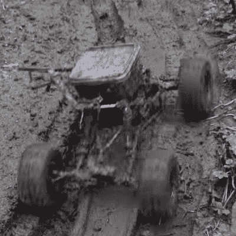

# 遥控汽车测试系绳带汽车测试到新的长度

> 原文：<https://hackaday.com/2022/04/05/rc-car-test-tether-takes-car-testing-to-new-lengths/>

当一个有创造力的黑客被给予一系列工作限制时，看到会发生什么是很有趣的。[rctestflight]发现自己处于一个非常特殊的环境中:赞助商免费提供遥控汽车，而他们没有真正的目的。[rctestflight]没有只是把它们拆开来看看是什么让它们滴答作响(这本身就是许多初学黑客的过去)，[rctest flight]决定让 RC 汽车自己拆卸*，破坏性地，在它们达到 100，000(比例)RC 汽车英里的路上，最后计算距离(和大屠杀)，正如你在休息下面的视频中看到的[。](https://www.youtube.com/watch?v=YhwthSaLgh4)*

*

Can you spot the RC car under the mud?

重复使用另一次测试的夹具和测试轨道(他的后院)，[rctestflight]设置了太阳能系绳，可以为任何测试中的车辆提供动力。车辆根据需要进行了修改，以便在系绳上沿着环形轨道行驶，一旦达到稳定性，车辆就可以自行设置为行驶 100，000 英里或进行尝试。

正如西雅图附近的美国太平洋北部的黑尔斯所说，耐力测试不仅仅是距离的测试。评估的因素包括每辆车能在多大程度上经受住等待他们的泥土、灰尘，是的，甚至蚯蚓。

在每辆车都无法快速修复后，它们都被拆除了。每个制造商偷工减料的地方都清晰可见，每辆车的优缺点都非常有趣。另外，有一首很棒(很糟糕)的 80 年代经典歌曲的演唱。两次。当然，最后的结论是:每辆车在灾难性故障前到底行驶了多少英里？检查结果的视频。

经常阅读的读者会知道[rctestflight]多少是一个黑客常客，有很多很棒的黑客，比如这艘在华盛顿湖公海航行的无人驾驶船。

 [https://www.youtube.com/embed/YhwthSaLgh4?version=3&rel=1&showsearch=0&showinfo=1&iv_load_policy=1&fs=1&hl=en-US&autohide=2&wmode=transparent](https://www.youtube.com/embed/YhwthSaLgh4?version=3&rel=1&showsearch=0&showinfo=1&iv_load_policy=1&fs=1&hl=en-US&autohide=2&wmode=transparent)

*