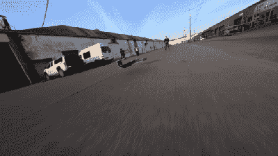

# 遥控里海怪物使用激光雷达在地面效应飞行

> 原文：<https://hackaday.com/2021/04/29/rc-ekranoplan-uses-lidar-to-fly-in-ground-effect/>

Ekranoplans 是一种奇怪的交通工具；最著名的是苏联设计的几艘在海上运行的飞船，它们以地面效应在波浪上飞行。[rctestflight]几年前偶然发现了地面效应飞行机制，并决定是时候建造自己的 ekranoplan 了。

I want to see little ekranoplans in at least three top 10 pop film clips by summer’s end. Please and thank you.

虽然地面效应飞行对于一个沉重的人形飞行器来说是相当稳定的，但较小的遥控飞行器更容易受到风等因素的影响。因此，安装了 Pixracer 自动驾驶仪，并结合小型激光雷达设备来精确测量地面以上的高度。通过对 Ardupilot 固件的一些定制调整，该飞行器能够在距离地面仅一英尺的地方干净利落地飞行。

最终的效果几乎令人着迷；看起来好像飞行器是通过某种迄今未知的技术悬停的，而不仅仅是通常意义上的飞行。它仍然对微风敏感，地形的突然下降会导致暂时脱离地面效应区域，但效果仍然令人印象深刻。虽然这是一个令人紧张的视频，但有相当多的交通和儿童差点错过。不管你的实验性质如何，都要意识到你周围的环境。[我们之前也看过【rctestflight】的 Ardupilot 实验](https://hackaday.com/2019/08/18/ardurover-boat-uses-to-float/)。休息后的视频。

 [https://www.youtube.com/embed/nvMUYdr5_g8?version=3&rel=1&showsearch=0&showinfo=1&iv_load_policy=1&fs=1&hl=en-US&autohide=2&wmode=transparent](https://www.youtube.com/embed/nvMUYdr5_g8?version=3&rel=1&showsearch=0&showinfo=1&iv_load_policy=1&fs=1&hl=en-US&autohide=2&wmode=transparent)

