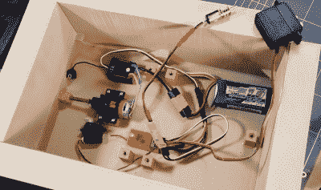

# 遥控《我的世界》船巡逻宝藏池

> 原文：<https://hackaday.com/2021/10/28/rc-minecraft-boat-patrols-the-pool-for-treasure/>

为了在现实生活中重现那些放松的*《我的世界》*钓鱼时光，[【电子同步】最近着手为自己 3D 打印一艘块状遥控船](https://thangs.com/electrosync/Radio-Controlled-Minecraft-Boat-28521)，配备一个类似立方体的乘员乘坐其中。从船桨到鱼线末端的浮子，这个造型的每一个元素都被设计得尽可能忠实于原始材料。事实上，整个事情是如此准确的游戏，它几乎是超现实的看到它在游泳池周围划船。

也就是说，有些相似之处只是表面现象。例如，划船的动作，虽然看起来与船在水中的运动完全同步，但完全是为了表演。船下的标准螺旋桨和方向舵配置提供了推进力和方向控制,[electrosync]指出，它实际上足够强大，可以将船推至接近游戏中的最高速度，尽管它基本上只是一个矩形，流体动力学非常差。

A look under the deck.

说到这里，[electrosync]甚至不厌其烦地用填充木材的 PLA 打印船体，并在上面涂上聚酯树脂，以确保不漏水。诚然，他本可以一开始就用木头来制造这艘船，这样就可以节省将近 60 个小时来打印船体零件，但这是作弊。

除了移动船只和船桨的伺服系统和马达之外，[electrosync]还必须给他的 3D 打印渔夫相当大的灵活性。嵌入 3D 打印部件的伺服系统允许“史蒂夫”在臀部旋转，并举起和放下他的手臂。随着鱼竿滑入印在手上的孔中，他能够抛出他的磁性浮子，并看到什么在咬他。

我们实际上已经看到相当多的项目[允许*《我的世界》*里面的虚拟物体与现实世界](https://hackaday.com/2021/07/17/control-an-irl-home-from-minecraft/)互动，但是相对较少的项目[从游戏的块状宇宙](https://hackaday.com/2016/10/21/minecraft-sword-lights-up-when-nearby-friends/)中重建物体，所以节奏的改变是好的。

 [https://www.youtube.com/embed/O1SIfNdOJJc?version=3&rel=1&showsearch=0&showinfo=1&iv_load_policy=1&fs=1&hl=en-US&autohide=2&wmode=transparent](https://www.youtube.com/embed/O1SIfNdOJJc?version=3&rel=1&showsearch=0&showinfo=1&iv_load_policy=1&fs=1&hl=en-US&autohide=2&wmode=transparent)

