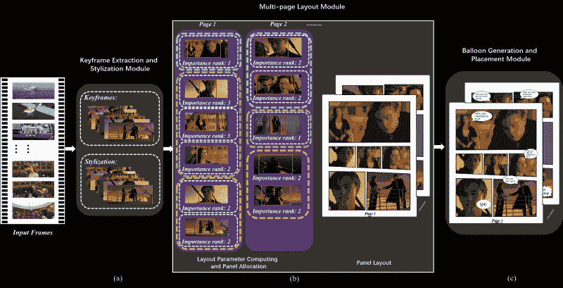

# 将您的电影作为自动生成的漫画书阅读

> 原文：<https://hackaday.com/2021/03/22/read-your-movies-as-automatically-generated-comic-books/>

一份来自中国大连理工大学和香港城市大学的研究论文概述了一个由 T4 自动从视频生成漫画的系统。但是，一种算法如何能够将视频场景浓缩，以适当地反映静态图像中场景的严重性？这一令人印象深刻的壮举是通过每秒保存两张静止图像，然后通过分析感兴趣区域和重要性排名将帧分割成场景来实现的。

对于它的下一个技巧，通过将字幕信息与视频的音频轨道相结合来处理每个场景的语音。对音频进行情感分析，以确定字幕文本的适当语音气泡类型和大小。甚至对帧进行分析，以确定哪个人在为正确放置气泡而发言。然后，它可以创建关键帧的布局，根据感兴趣区域分析确定每页的面板大小。

这个过程是通过[量化、](https://en.wikipedia.org/wiki/Color_quantization)为经典的 cel 阴影外观使用平面颜色对关键帧进行风格化，然后用每个帧和单词气球填充布局来完成的。

该团队对 40 名用户进行了一项研究，将他们的结果与需要更多人工干预的先前技术进行了对比，但仍然在各个方面都优于他们。像任何伟大的超级英雄一样，该团队仍然看到了改进的空间。在未来，他们希望提高关键帧选择的准确性，并建议使用神经网络来做到这一点。

感谢[Qes]的提示！