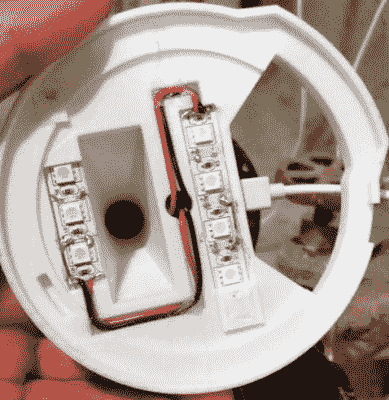

# 用 ESP8266 直接读取水表读数

> 原文：<https://hackaday.com/2019/09/06/reading-the-water-meter-in-a-literal-sense-with-an-esp8266/>

在我们沉迷于信息的文化中，黑客对量化他们周围世界的方法越来越感兴趣。一个受欢迎的项目是收集关于他们家庭能源或水消耗的数据，以试图确定任何趋势或潜在的低效率。出于安全和潜在的法律原因，这通常必须以最小侵入的方式进行，而不损害由公用事业提供商完成的计量。如你所料，这通常会导致一些创造性的数据收集方法。

最新的解决方案来自[【Keilin Bickar】，他正在使用 ESP8266 和一个串行 TTL 摄像头模块从他的水表的 LCD](https://medium.com/@trumpetgod/integrating-my-neptune-water-meter-with-home-assistant-896712a8c893) 中读取字符。通过 3D 打印外壳兼作相机的光源，成品设备位于水表顶部，并通过 MQTT 将当前读数发送到 HomeAssistant，无需任何永久布线或安装。

 当然，ESP8266 并不是我们通常看到的执行光学字符识别的平台。需要一些聪明的编程来让 Wemos D1 Mini Lite 可靠地读取电表中的数字，而不必将任务推给计算能力更强的设备，如 Raspberry Pi。该过程从 VC0706 相机模块提供的 160×120 JPEG 图像开始，然后使用 JPEG 解码器库对其进行处理。图像的顶部和底部被丢弃，并且中心带被隔离成与显示器上每个数字的位置相对应的块。

在每个块中，代码检查预定点的阵列，以查看相应的像素是否为黑色。理论上，这允许检测 0 到 9 之间的所有数字，尽管[Keilin]说，由于相机和安装的内在不稳定性，仍有偶尔的错误读数。但是，通过对代码进行几次迭代，并借助 Python 测试程序来验证算法变化的影响，他能够大大提高检测精度。他说，这也有助于数据的性质允许一些基本的健全检查；例如，这个数字只会上升，而且每次上升的幅度相对较小。

这种方法可能不允许我们最近看到的令人印象深刻(如果有点令人毛骨悚然)的用水数据挖掘所需的每秒采样[，但是只要你不追求非常高分辨率的数据，这是一种从现有的公用事业仪表中提取有用数据的优雅和创造性的方法。](https://hackaday.com/2019/08/14/data-mining-home-water-usage-your-water-meter-knows-you-a-bit-too-well/)