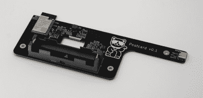

# 在这个美丽的 E-Ink 相框上接收虚拟明信片

> 原文：<https://hackaday.com/2022/05/22/receive-virtual-postcards-on-this-beautiful-e-ink-photo-frame/>

给爱人寄明信片曾经是旅行者的标准程序，那时候旅行很迷人，通讯也很慢。虽然一些旅行者仍然保持着这一传统，但许多人已经用即时消息和社交媒体取代了邮票和邮局——更快、更方便，但比收到一张来自遥远国度的手写信息的明信片要少得多。

[卡梅伦]设计了一个明信片相框，旨在带回一点那种魔力。这是一个木制的框架，里面有一个电子墨水显示器，显示你的朋友发给它的图片。他们只需要打开你事先发给他们的唯一链接，上传一张有趣的照片；相框将根据可调整的时间表循环显示提交的内容。网络界面允许你改变设置和删除任何不合适的图像。

 木质框架制作精美，但内部光滑的黑色 PCB 是一件真正的艺术品。它装有电池和 USB-C 充电电路，以及连接到 WiFi 的 ESP32，存储图像并将其缩小到显示器使用的 800×480 单色格式。[Cameron]没有准确测量电流消耗，但估计由于电子墨水显示器的功耗要求极低，一次充电应该可以工作一年左右。

让你的朋友们决定展示在你房子里的图像是一个有趣的想法，如果你能相信他们会保持体面的话。如果你想对你的电子墨水显示器有更多的控制，看看这个太阳能供电的模型或者 T2 的壁挂式报纸显示器。

 [https://www.youtube.com/embed/UVv96yChRDg?version=3&rel=1&showsearch=0&showinfo=1&iv_load_policy=1&fs=1&hl=en-US&autohide=2&wmode=transparent](https://www.youtube.com/embed/UVv96yChRDg?version=3&rel=1&showsearch=0&showinfo=1&iv_load_policy=1&fs=1&hl=en-US&autohide=2&wmode=transparent)

