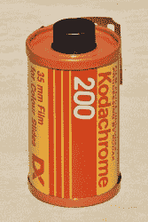
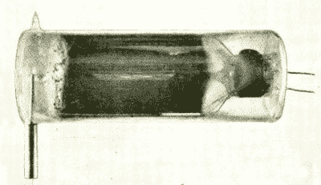
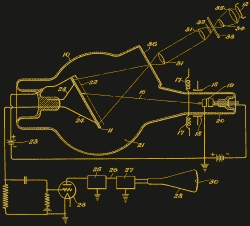
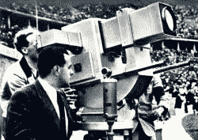
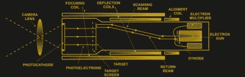
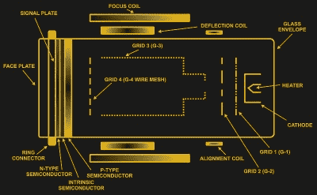

# CRT 时代的录像:摄像管

> 原文：<https://hackaday.com/2020/02/27/recording-video-in-the-era-of-crts-the-video-camera-tube/>

我们都看过追溯到 20 世纪 50 年代的音乐会和活动的视频，但可能从未真正想过这是如何做到的。毕竟，从 19 世纪晚期开始，在胶片上记录运动图像就已经完成了。在 20 世纪 80 年代发明 CCD 图像传感器之前，这种方法一直沿用至今，是吗？没有。

虽然胶片在 20 世纪 80 年代仍被普遍使用，电影甚至整个电视系列片如《星际迷航:下一代》都被录制在胶片上，但胶片的主要缺点是需要移动实体胶片。想象一下 1969 年从月球上传来的现场视频，如果当时只有胶片录像机就好了。

让我们来看看视频摄像管:几乎被遗忘的技术，使广播行业。

## 一切都从照片开始

在胶片上记录的原理与摄影的原理并没有太大的不同。根据胶片的类型，光强度被记录在一层或多层中。[显色](https://en.wikipedia.org/wiki/Chromogenic)(彩色)摄影用胶片一般有三层，分别为红、绿、蓝。根据光谱中该部分的光的强度，它将更多地影响相应的层，这在胶片被显影时显示出来。一种非常熟悉的使用这种原理的电影是[柯达彩色胶卷](https://en.wikipedia.org/wiki/Kodachrome)。

虽然电影非常适合静态摄影和电影院，但它不符合电视的概念。简单来说，电影不播。现场直播在广播中非常受欢迎，而电视需要能够比电影胶片被运送到全国或全世界更快地分发其活动图像。

An image dissector tube

考虑到 20 世纪第一个十年的电子技术水平，某种形式的阴极射线管显然是将光子转换成电流的解决方案，这种电流可以被解释、传播和存储。这种所谓的视频摄像管的想法成为这几十年来许多研究的焦点，导致了 20 世纪 20 年代[析像管](https://en.wikipedia.org/wiki/Image_dissector)的发明。

析像管使用一个透镜将图像聚焦在一层感光材料(例如氧化铯)上，感光材料发出的[光电子](https://en.wikipedia.org/wiki/Photoelectric_effect)的数量与光子数量的强度相关。来自一个小区域的光电子然后被操纵到一个[电子倍增器](https://en.wikipedia.org/wiki/Electron_multiplier)中，以从撞击感光材料的图像部分获得读数。

## 调高亮度

Iconoscope diagram, from Vladimir Zworykin’s 1931 US patent.

虽然析像管基本上按预期工作，但该设备的低感光度导致图像质量差。只有在极度照明的情况下，人们才能辨认出场景，这使得大多数场景都无法使用。这个问题直到使用电荷存储板概念的[光电摄像管](https://hackaday.com/2017/07/19/i-am-an-iconoscope/)发明后才得以解决。

光电摄像管在感光层中添加了一个银基电容器，使用云母作为覆盖有感光材料的银小球和云母板背面的银层之间的绝缘层。结果，银小球会被光电子充电，之后这些小球的每个“像素”都可以被阴极射线单独扫描。通过扫描这些带电元素，产生的输出信号与析像管相比有了很大改善，使其成为 20 世纪 30 年代初推出的第一台实用摄像机。

然而，它仍然有一个相当嘈杂的输出，由 [EMI](https://en.wikipedia.org/wiki/EMI) 进行的分析显示，它的效率只有 5%左右，因为二次电子在扫描过程中破坏并中和了存储板上存储的电荷。解决方案是将电荷存储与光发射功能分开，创造出本质上是析像管和光电摄像管的组合。

在这种“图像光电摄像管”或也被称为超级发射管中，[光电阴极](https://en.wikipedia.org/wiki/Photocathode)将从图像中捕获光子，产生的光电子被导向目标，产生二次电子并放大信号。英国 super-Emitron 中的靶板在结构上类似于光电摄像管的电荷存储板，用低速电子束扫描存储的电荷，以防止二次电子。1937 年，英国广播公司在拍摄停战日国王敬献花圈时，首次使用超级发射器进行户外活动。

 图像光电摄像管的靶板省略了超发射子的颗粒，但其他方面是相同的。它在 1936 年柏林奥运会上首次亮相，随后由德国公司 Heimann 制造的图像光电摄像管(德语为“Super-Ikonoskop”)商业化，使其成为广播标准，直到 20 世纪 60 年代初。超级 Ikonoskop 商业化面临的一个挑战是，在 1936 年柏林奥运会期间，每根显像管只能持续一天(T4)，阴极就会耗尽。

## 商品化

Schematic diagram of an orthicon video camera tube.

美国广播公司将很快从光电摄像管转向图像或图像电视。图像 orthicon 与图像光电摄像管和超级发射管有许多共同的特性，并在 1946 年至 1968 年间用于美国广播。它使用了与 orthicon 相同的低速扫描束来防止二次电子，并使用了一种中间版本的发射管(类似于光电摄像管)，称为阴极电位稳定(CPS)发射管。

在图像光电摄像管、超级发射管和图像 orthicon 之间，电视广播已经达到了一个质量和可靠性的点，使其在 20 世纪 50 年代迅速普及，因为越来越多的人买了电视机在家里看电视，伴随着越来越多的内容，从新闻到各种类型的娱乐。这一点，以及在科学和研究中的新用途，将推动一种新型摄像管的发展:光导摄像管。

光导摄像管是在 20 世纪 50 年代发展起来的，是对图像正射象管的改进。他们使用光电导体作为目标，通常使用硒作为其光电导性，尽管飞利浦将在它的铅系列摄像管中使用氧化铅。在这种类型的装置中，由光子在半导体材料中感应的电荷将转移到另一侧，在那里电荷将被低速扫描束读出，这与图像 orthicon 或图像光电摄像管中的情况没有什么不同。

尽管比非光导摄像管制造成本更低，使用更稳定，但光导摄像管确实存在延迟问题，因为电荷通过光电导层需要时间。它弥补了这一点，通常具有更好的图像质量，并且没有由场景中极端亮度点引起的二次电子“飞溅”引起的光晕效应。

在美国阿波罗登月计划中，登上月球的[摄像机将是 RCA 开发的基于摄像机的单元，使用定制编码，并最终成为彩色摄像机。尽管当时许多美国家庭仍拥有黑白电视机，但任务控制中心获得了宇航员在月球上活动的实时彩色画面。最终，彩色照相机和彩色电视也会在地球上变得很普遍。](https://en.wikipedia.org/wiki/Apollo_TV_camera)

## 添加颜色

Video transmission from the Apollo 10 spacecraft on 18 May 1969.

将色彩引入电影和摄像机是一个有趣的挑战。毕竟，要记录黑白图像，只需记录当时光子的强度。为了记录场景中的颜色信息，必须记录场景中具有特定波长的光子*的强度。*

在柯达彩色电影中，这个问题通过三层来解决，每种颜色一层。在地面摄像机中，[二向色棱镜](https://en.wikipedia.org/wiki/Dichroic_prism)将入射光分成这三个范围，每个范围都由自己的显像管单独记录。在阿波罗任务中，彩色相机使用机械[场序制彩色系统](https://en.wikipedia.org/wiki/Field-sequential_color_system)，该系统采用旋转色轮，仅使用一根管子，在滤色片就位时捕捉特定的颜色。

## 再见，感谢所有的光子

最终一种更好的技术出现了。在摄像机的情况下，这是第一个电荷耦合器件( [CCD](https://en.wikipedia.org/wiki/Charge-coupled_device) )传感器的发明，后来是 [CMOS 图像传感器](https://en.wikipedia.org/wiki/Active-pixel_sensor)。这些消除了对阴极射线管的需要，使用硅作为感光层。

但是 CCD 并没有立即接管。20 世纪 80 年代早期大规模生产的 CCD 传感器被认为没有足够的质量来取代电视演播室摄像机，并被归入更重要的紧凑尺寸和低成本的摄像机。在 20 世纪 80 年代，CCD 得到了巨大的改进，随着 20 世纪 90 年代 CMOS 传感器的出现，视频摄像管的时代很快就结束了，只有一家公司仍在生产 Plumbicon 光导摄像管。

尽管大部分被大多数人遗忘了，但不可否认的是，摄像管对今天的社会和文化有着持久的影响，使我们今天认为司空见惯的许多事情成为可能。