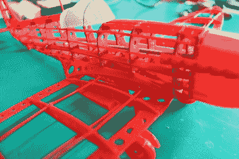

# 用现代技术再造经典模型套件

> 原文：<https://hackaday.com/2019/04/05/recreating-classic-model-kits-with-modern-tech/>

过去，如果你想做一个漂亮的飞机模型，你需要用薄的轻木肋骨做框架，然后用薄纸把它盖起来。顺便说一句，在 20 世纪 30 年代之前，他们或多或少是这样制造大多数真正的飞机的，所以在较小的规模上做同样的事情并不是完全不合理的。但是，一旦注射成型塑料流行起来，木材和组织模型工具包很大程度上就消失了。

[Marius Taciuc]希望与他的儿子分享这种经典的模型制作经验，但[他没有在 2019 年尝试寻找 balsa 工具包，而是决定用现代技术重新创造这个概念](https://hackaday.io/project/164666-building-a-spitfire-model-plane-with-my-son)。他的超级海上喷火战斗机模型是英国皇家空军在第二次世界大战期间的先锋，重现了那些早期模型套件的外观，但用 3D 打印或激光切割的组件代替了过去脆弱的轻木条。材料可能是高科技的，但正如休息后的视频所证明的那样，建造这个东西仍然和以前一样耗时。

 使用激光切割机生产零件将是组装你自己的工具包的最快方法(在这种情况下，你甚至可以从轻木中切割出零件)，但你仍然需要一台 3D 打印机来生产一些组件，如螺旋桨和整流罩。另一方面，如果你像[Marius]那样 3D 打印所有部件，你可以使用烙铁快速安全地将所有部件“焊接”在一起。对于任何可能会感到疑惑的人来说，尽管最终飞机的尺寸很大，但所有单个组件的尺寸都已确定，因此一切都可以在相当标准的 200 x 200 mm 打印床上打印。

毫无疑问，成品看起来很漂亮，但有些人可能会怀疑，花费大量的精力和时间来生产和组装令人眼花缭乱的组件是否真的值得。为此，[马里乌斯]说这更多的是一次学习经历。当然，他可以买一个简化的塑料喷火模型，然后和他的儿子在一个下午组装起来，但是他们真的了解过真实世界中的模型吗？通过一件一件地组装飞机，这给了他们一个真正检查这架传奇飞机的细微差别的机会。

我们在 Hackaday 上不常看到来自模特界的消息，但不是因为缺乏兴趣。我们总是对建模者为了获得完美的比例外观而付出的努力感到敬畏，从[将令人难以置信的技术装进微型战斗机](https://hackaday.com/2014/11/11/tiny-rc-p-51d-mustang-tips-the-scales-at-3-grams/)到[标志性引擎的大规模复制品](https://hackaday.com/2017/09/11/if-youre-going-to-make-a-model-engine-you-might-as-well-make-it-a-merlin/)。如果你有一些很棒的模型制作技巧，你认为黑客读者可能会感兴趣，不要害羞。

 [https://www.youtube.com/embed/KGvR3ibxaFY?version=3&rel=1&showsearch=0&showinfo=1&iv_load_policy=1&fs=1&hl=en-US&autohide=2&wmode=transparent](https://www.youtube.com/embed/KGvR3ibxaFY?version=3&rel=1&showsearch=0&showinfo=1&iv_load_policy=1&fs=1&hl=en-US&autohide=2&wmode=transparent)

