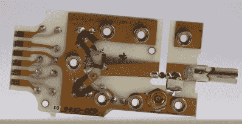
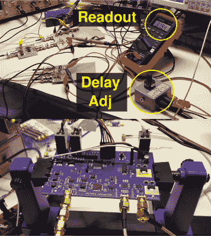
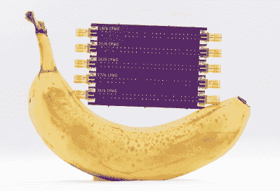

# 重建快速示波器是一个缓慢的过程

> 原文：<https://hackaday.com/2020/02/10/recreating-fast-oscilloscopes-is-a-slow-process/>

如果你想做一件你以前从未做过的事情，有两种大致定义的方法来实现它:要么你尽你所能地学习并尝试第一次就把它做好，要么你亲自动手，一路解决细节问题。凭感觉生活有很多好处。问问那些在最后期限的第 11 个小时找到灵感的人，仅仅是因为他们别无选择。

Ted Yapo 在着手构建开源多 GHz 采样示波器时并没有太多的高速设计知识，但他并没有因此而止步。快进一年左右，Ted 准备建造他的第三个原型，用他从前两个原型中获得的所有实践知识武装起来。

在 2019 年 Hackaday 超级大会上， [Ted 讲述了他进入高风险高速设计世界的旅程](https://www.youtube.com/watch?v=99u53V7uDFY)。这是一个鼓舞人心的演讲，Ted 很好地回顾了他在尝试构建一个取样范围时所学到的一切。我们认为你不仅会欣赏 Ted 的作品，还会欣赏他解释这一切的轻松。

 [https://www.youtube.com/embed/99u53V7uDFY?version=3&rel=1&showsearch=0&showinfo=1&iv_load_policy=1&fs=1&hl=en-US&autohide=2&wmode=transparent](https://www.youtube.com/embed/99u53V7uDFY?version=3&rel=1&showsearch=0&showinfo=1&iv_load_policy=1&fs=1&hl=en-US&autohide=2&wmode=transparent)

那么为什么 Ted 要做这些呢？首先，他的 1989 年泰克已经行驶了 75，000 多个小时，它不会永远这样。更大的问题是，这是最后一批使用等效时间采样的数字示波器之一，因为制造商在几年内就跳到了实时采样。Ted 看到了用现代技术复制这一点的机会，我们在这里使劲点头，留出现金，以备随时购买或建造。

## 等效时间采样

Ted 使用的第一台示波器是一台 1968 年的泰克，所以那是他开始研究的地方。他的旅程从那个古老的问题开始:等效时间采样示波器究竟是如何工作的？他找到了那辆老爷车的示意图和描述，然后买了一辆二手的，把它拆了。

泰德在取样头里发现的东西似乎简单得惊人。有两个肖特基二极管进行采样，由阶跃恢复二极管控制的独立选通电路向它们提供短电流脉冲。

Ted 很快发现最大的障碍是产生这些极快的脉冲。他发现，虽然业余爱好者很难获得速度降至个位数皮秒范围的尖端组件，但用负担得起的组件绝对有可能达到 20-30 ps 范围。

##  模数转换

掌握了足够的危险知识后，Ted 使用一个六肖特基二极管门和几个 74HC 逻辑芯片构建了一个模拟采样器来产生选通脉冲。Ted 说，他花了半个小时来采集第一个样本，因为 UI 完全是手动的——他使用电位计采样，从电压表上读取数值，然后将它们全部写下来，覆盖了五张纸。但它成功了，他计算出带宽为 141MHz。

对于他的第二个原型，特德去数字化。他解释说，这种方法使用比较器:它比较两个输入，并使用逐次逼近法判断一个是否高于另一个。这是取样部分。但你还需要一个时基，他最终使用了一个开关门延迟来对齐时钟边沿。

Ted 的第二个原型比第一个快几个数量级。他的带宽高达 7GHz，上升时间降至 48 皮秒，平均每秒 100 千兆样本。令人惊讶的是，BOM 包括 PCB 在内不到 100 美元。你开始流口水了吗？

##  快速信号为快速范围

那么，你能用这么快的示波器做什么呢？Ted 想做的一件事是时域反射仪(TDR)，这很像传输线的雷达。通过沿 PCB 走线或电线发送信号并测量返回的信号，可以确定电路或电路部分的特征阻抗。

Ted 讨论了高速电路设计中的一个常见问题:计算共面波导所需的正确走线宽度。换句话说，连接元件的铜波形线应该有多宽才能达到标准的 50ω阻抗？许多计算器都是为了简化这一过程，但它们都是建立在坚实的理论基础上，无法解释 PCB 中玻璃纤维阻抗不均匀的现实。所以 Ted 做了一块板来测试不同的走线宽度。没有一个能精确达到 50ω，但通过他方便的新 7GHz 示波器，他能够轻松确定在给定环境下 22mil 走线是最佳的。

对于第三个原型，Ted 正在寻找一个 32 位的 CPU 和一种增强时基电路的方法。除了超宽带雷达和激光雷达，Ted 还在寻找有趣的用例，所以如果你有需要探测的快速信号，请在 IO 或 Twitter 上联系他。