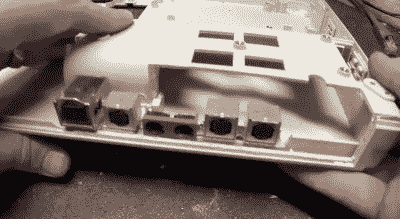

# 黑客重现尼康勋爵的笔记本电脑

> 原文：<https://hackaday.com/2019/10/15/recreating-lord-nikons-laptop-from-hackers/>

1995 年的*黑客*中的古怪电脑很容易成为经典邪教中最令人难忘的元素之一。在这部电影中，每台机器都是定制的，以反映操作它的个人黑客，并具有从喷漆迷彩方案到基于所有者个人肖像的主题引导动画的一切功能。但可能不那么明显的是，现实生活中的道具在准备好大银幕亮相之前，进行了大量的硬件黑客攻击。

一群忠实的黑客粉丝创建了一个网站，记录并理想地再现了电影中各种技术的定制工作。正如[Nandemoguy]，[所解释的，该组织的最新胜利是一个屏幕精确的尼康勋爵笔记本电脑](https://www.youtube.com/watch?v=uxY6CUimZ9M)的构建。最终产品不仅看起来像电影中使用的机器，而且由于内部的树莓派，比原始计算机要强大得多。

除非你是 HackersCurator.com 团队的成员，否则你可能不知道电影中的笔记本电脑是手工制作的怪物，将各种电脑的外壳与(通常)苹果 Powerbook 180c 的内部结合在一起。为什么这部电影的道具师傅会经历这么多麻烦来创建角色的计算机还不清楚，但如果我们不得不猜测，大概是因为电影中大量出现的过度图形界面的要求。

 无论如何，【Nandemoguy】创造的复制品也是以差不多同样的方式建造的。至少从外表上看是这样的。他经历了大量的机箱修改，将东芝 Satellite T1850 上的原始键盘替换为 Powerbook 键盘，正如你可能已经猜到的那样，Powerbook 键盘已经被[转换为带有微型微控制器](https://hackaday.com/2018/12/04/teensy-liberates-the-thinkpad-keyboard/)的 USB HID 设备。他甚至把 Mac 主板背面的端口切掉，然后把它们粘在机器背面。但其他所有东西，包括液晶显示器，都是全新的硬件。毕竟，谁*真的*愿意在 2019 年经历所有这些麻烦，只为了拥有一台花哨的 Powerbook 180c？

即使你不是*黑客*的粉丝，这款游戏的细节和投入的精力绝对是惊人的。有趣的是看到这个复制品和新兴的网络平台场景之间的相似之处[；似乎只要一个 Teensy，一个树莓派，](https://hackaday.com/2019/07/16/raspberry-pi-cyberdeck-inspired-by-rare-msx/)[和足够的 Bondo](https://hackaday.com/2018/02/22/skull-cane-proves-bondo-isnt-just-for-dents/) ，任何东西都可以变成一台功能电脑。

 [https://www.youtube.com/embed/uxY6CUimZ9M?version=3&rel=1&showsearch=0&showinfo=1&iv_load_policy=1&fs=1&hl=en-US&autohide=2&wmode=transparent](https://www.youtube.com/embed/uxY6CUimZ9M?version=3&rel=1&showsearch=0&showinfo=1&iv_load_policy=1&fs=1&hl=en-US&autohide=2&wmode=transparent)

