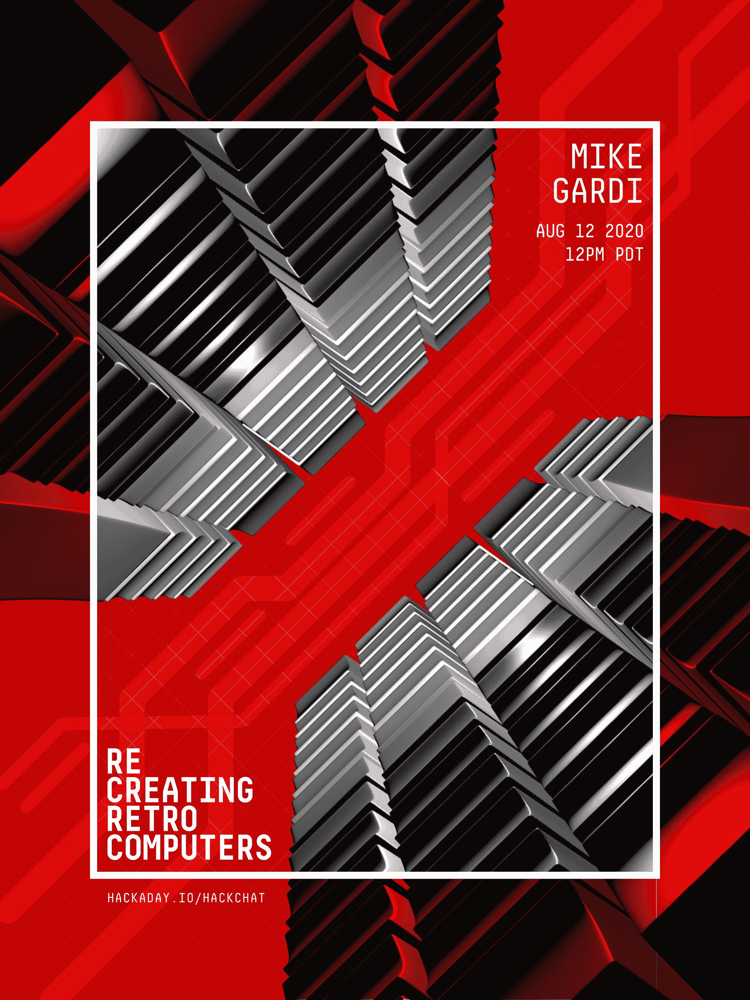

# 重现复古电脑黑客聊天

> 原文：<https://hackaday.com/2020/08/10/recreating-retrocomputers-hack-chat/>

加入我们太平洋时间 8 月 12 日星期三中午[与](https://hackaday.io/event/173293-recreating-retrocomputers-hack-chat)[迈克·盖迪](https://hackaday.io/Megardi)的重现复古电脑黑客聊天！

在 20 世纪 50 年代末和 60 年代初，制造第一台商用计算机当然是一项复杂的任务，但建立计算机产业就更难了。当然，工程师们已经开始用硅和锗代替玻璃和钨进行设计，所有的数字电路实际上只是他们中大多数人已经熟悉的模拟设计的抽象。但是，对于那些需要加快数字计算机工作速度的人来说呢？如果知道如何使用工具的人是制造工具的人，那工具有什么用？

为了让计算机赚钱，公司需要大量的安装人员、操作员、程序员、营销人员和销售人员，他们都需要培训。所以早期的计算机公司花了很大力气来建造训练设备，让人们跟上速度。这些培训师帮助教授从基本逻辑电路和布尔关系到简单编程概念的所有内容，他们每个人都以自己的方式为发展我们今天所知的计算机行业做出了贡献。

迈克·盖迪有一个独特的爱好:除了其他事情之外，他还忠实地复制了一些丢失的计算机历史的好例子。他复制的 Claude Shannon 的 Minivac 601 训练器是艺术的一个很好的例子，正如[他目前正在建造的 DEC H-500 计算机实验室](https://hackaday.com/2020/06/28/reproduction-1960s-computer-trainer-really-pushes-our-buttons/)一样。一路上，他探索了通往我们计算机化世界的道路上的一些小巷子，比如[尼姆博士](https://hackaday.com/2018/12/24/vintage-toys-live-on-through-3d-printing/)和[曲别针电脑](https://hackaday.com/2020/02/08/a-modern-take-on-the-paperclip-computer/)。他所有的作品都是用 3D 打印技术精心制作的，真正抓住了当时玩具和工具的精髓。

加入我们的行列，进入逆向计算的利基领域，了解为什么 Mike 认为花费时间建造如此精确的复制品是如此有趣。我们将谈论他现在正在进行的项目，他对未来有什么计划，甚至可能会探究他制作如此好看的 3D 打印品的一些秘密。

 我们的黑客聊天是 [Hackaday.io 黑客聊天群发消息](https://hackaday.io/messages/room/2369)中的社区直播活动。本周，我们将于太平洋时间 8 月 12 日星期三中午 12:00 开始讨论。如果时区让你和我们一样困惑，我们有[一个方便的时区转换器](https://www.timeanddate.com/countdown/generic?iso=20200812T12&p0=224&msg=Recreating+Retrocomputers+Hack+Chat&font=cursive)。

点击右边的那个发言气泡，你会被直接带到 Hackaday.io 上的黑客聊天群，不用等到周三；随时加入，你可以看到社区在谈论什么。

