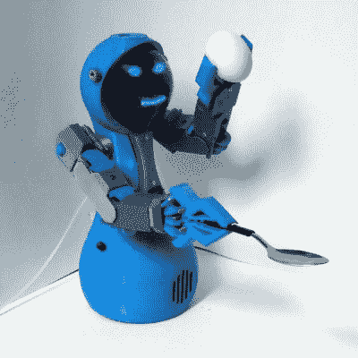

# 重新定义机器人是最新的黑客奖挑战

> 原文：<https://hackaday.com/2021/08/23/redefine-robots-is-the-newest-hackaday-prize-challenge/>

机器人专家和自动化爱好者们，开动你们的引擎吧。这个 2021 年黑客日有奖挑战赛是专为你而设的！这是[重新定义机器人的挑战](https://prize.supplyframe.com/#section-challenges),它呼吁未来自动化的未来可以有更柔和、更乌托邦的一面。

机器人的承诺一直是让我们的生活变得更好。但到目前为止，我们仍然没有一个机器人助手坐在我们旁边准备伸出援手。这就是你进来的地方！无论是实体的、坚果和机器人，还是 1 和 0 的软件机器人，创造一些人们在日常生活中可以看到和互动的东西，让我们对技术的发展方向感觉良好。

 我们取笑被带到这个世界上来传递黄油的机器人，但老实说，如果有人需要帮助，机器人不是一个很好的解决方案吗？这是 2016 年 Hackaday 奖时[Michael Roybal]的想法，当时[他设计了机器人 Zizzy 在桌面](https://hackaday.io/project/12789-zizzy-a-personal-robot-assistant)上滑行，帮助行动不便的人。

同年，[迈克·瑞斯比]正在研究一个小机器人，它的目的是四处走动，与人互动。一个机器人伴侣(我们敢说宠物吗？)是让长时间独处的人保持互动的一种方式。同样的还有[已经参加今年比赛的 EMOJO 聊天机器人](https://hackaday.io/project/180133-emojo-mental-health-chatbot)，该比赛旨在在屏幕上提供一个数字伴侣。

辅助机器人不是唯一在这里大放异彩的。考虑一些节省劳动力的产品，比如帮助你制造电子产品的拾放机器人。那会重新发明机器人吗？也许是，也许不是，但[让 3D 打印机为你焊接](https://hackaday.com/2021/07/22/modified-3d-printer-solders-through-hole-components/)肯定会。想想对于那些既拥有硬木地板又养猫的人来说，机器人吸尘器是多么具有革命性。那些机器人一直在人类周围，现在看起来很正常。下一个自动化是什么，让这种介绍进入日常生活？

这一轮的 10 名决赛选手将赢得 500 美元，并在 10 月份进入最后一轮评审，有机会获得 25，000 美元的 Hackaday 奖和其他四个最高奖项。在 Hackaday.io 上启动您的项目页面，并使用左侧栏中的下拉菜单将其输入到 2021 年 Hackaday 大奖的[中。](https://prize.supplyframe.com/)

[hack adayprize 2021](https://prize.supplyframe.com)主办单位: