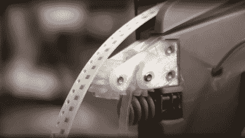

# (重新)设计 LumenPnP 带式给料机

> 原文：<https://hackaday.com/2022/08/15/redesigning-the-lumenpnp-tape-feeder/>

我们中的许多硬件导向型黑客可能会一直关注[Stephen Hawes]和 Lumen pick-and-place 项目的故事，但可能会等到项目更加成熟后再决定购买一个工具包。其中一个原因可能是，虽然基本的机器设计已经存在并在工作，但带式给料机确实需要做一些工作，缺乏可用的给料机不会成为一个伟大的 PnP 机器。[Stephen]一直致力于解决一些已确定的缺点的更新设计，[已经开始记录他的进展](https://www.youtube.com/watch?v=nHF0D_noWAw)(视频，嵌入下方)。

基于 PCB 的“外壳”已经一去不复返了，回到了 3D 打印和更小的 PCB。在不同的齿轮 DC 电机之间转换了一下后，[Stephen]决定回到原来的较小的单元，经过一点点的黑客攻击，被说服接受从另一个单元剥离的光学编码器，这证明它确实超过了磁带推进的职责。这种变化的原因是物理尺寸-原始电机导致 38 毫米宽的组件-这将前轨上的馈线数量限制为 11 个单位。这还不够，但随着装配变窄，宽度减少到 15.5 毫米，允许 27 个进料器在轨道上相互依偎，这应该使机器更加可用。

另一个值得关注的领域是盖带剥离器。重要的是，随着胶带的前进，对于每个拾取操作，覆盖膜以正确的速度剥离，并有足够的张力克服任何多余的粘性区域。最初的设计使用一个单独的电机将胶片缠绕在一个卷轴上，但这个卷轴又很宽，需要一个更窄的解决方案。这是通过将薄膜送入一对相对的直齿轮来改进的，直齿轮由蜗轮从一侧驱动。薄膜在一侧剥离，穿过进料器主体中的导槽，然后向前到达拉出机构。简单有效。

最后一个值得关注的地方是，进料装置在前轨(看起来像一段 2020 的挤压长度)上的安装方法有点不稳定，允许在几个方向上移动，这对于可重复拾取来说不是很好，即使有令人敬畏的 OpenPNP 视觉系统尽可能地将其拨入。重新设计的外壳符合导轨轮廓，使其能够更紧密地配合，并通过可更换的 3D 打印挠曲件保持张力。快速“啪”的一声，它就在张力下固定住了，抖动成为了历史。

显然，我们最近[报道了 LumenPnP】，这里](https://hackaday.com/2022/01/04/angel-investor-gives-open-source-pnp-a-massive-boost/)[，稍早](https://hackaday.com/2020/05/11/open-source-pick-and-place-has-a-450-bom-cost/)，我们还不打算结束这个故事。对于我们这些做大量小批量 PCB 组装的人来说，机器现在看起来更可行了，我们肯定会在未来几个月密切关注进展！

 [https://www.youtube.com/embed/nHF0D_noWAw?version=3&rel=1&showsearch=0&showinfo=1&iv_load_policy=1&fs=1&hl=en-US&autohide=2&wmode=transparent](https://www.youtube.com/embed/nHF0D_noWAw?version=3&rel=1&showsearch=0&showinfo=1&iv_load_policy=1&fs=1&hl=en-US&autohide=2&wmode=transparent)

感谢[Abe]的提示！