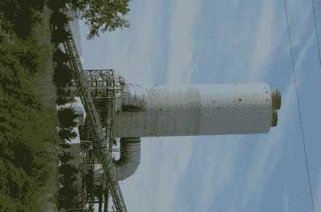

# 减少硫排放可能导致气候冲击

> 原文：<https://hackaday.com/2022/08/04/reduced-sulfur-emissions-could-cause-climate-shock/>

如今，当我们谈论排放时，我们通常会谈到为了环境的利益而减少排放。然而，气候系统是一只复杂的野兽，我们仍在学习理解它。

事实证明，减少排放可能会产生意想不到的或不良的影响。一些科学家担心，减少人类引起的硫排放实际上可能会使地球变暖。

## 硫排放是怎么回事？

The G.G. Allen Steam Plant features a large scrubber to reduce sulfur dioxide emissions from the plant. These are common in developed countries to reduce pollution. Credit: [Murr Rhame, CC-BY-SA-3.0](https://en.wikipedia.org/wiki/File:G_G_Allen_Steam_Plant,_scrubber.JPG)

在过去的几十年里，人们已经做了大量的工作来减少硫的排放。这有多种形式，但通常归结为针对化石燃料来源。欧盟、美国和许多其他管辖区已经立法降低柴油燃料中的硫含量。这导致了更清洁的发动机设计，其排放控制装置依靠较低的硫含量来工作。类似的努力也被用来降低船用燃料中的硫含量。许多燃煤电厂也通过使用烟气脱硫设备减少了二氧化硫的排放。

减少硫排放的初衷是好的。SO2 和其他硫氧化物(SOx)对人体健康有害。空气中高含量的硫氧化物会损害植物的生长，这些排放物也会导致酸雨。

然而，事实证明，硫排放往往有助于产生硫基气溶胶，最终进入平流层。这些气溶胶实际上增加了从地球反射回来的阳光量。通过这种方式，它们对地球产生了降温效应——与二氧化碳和甲烷等温室气体截然相反。

总的来说，减少硫排放的努力是成功的。随着时间的推移，越来越多的国家转而使用更清洁的低硫燃料，海运业也积极跟进。特别是，自 2020 年以来，全球航运业的硫排放量下降了 80%。冠状病毒疫情爆发的第一年，航运活动突然减少，加剧了这种影响。

## 那么问题出在哪里？

问题是硫排放产生的悬浮微粒可能在冷却地球方面做了有益的工作。随着多年来我们的温室气体排放持续增加，硫排放的冷却效应可能隐藏了一些正在造成的损害。

随着硫排放的如此快速减少，我们可能会面临一种叫做“气溶胶冲击”或“终结冲击”的东西。一旦冷却气溶胶的产生停止，地球的气候就会在这里迅速升温。这可能会对气候产生迅速而灾难性的影响，或者至少是意想不到的影响。

不幸的是，现阶段我们对气溶胶的了解还很有限。[模型显示](https://twitter.com/LeonSimons8/status/1456615547689390082)减少硫排放的影响可能是不可测量的，或者可能是区域性甚至全球性的严重变暖。这是一个广泛的选择，表明我们需要更好地了解问题，然后才能确定。

Acid rain is just one of the many negative effects of sulfur emissions. Thus, reducing sulfur emissions is necessary, but may not be without consequences. Credit: [Nino Barbieri, CC-BY-2.5](https://commons.wikimedia.org/wiki/File:Pollution_-_Damaged_by_acid_rain.jpg)

然而，我们确实有一些测量表明，这里可能有一个真正的问题。将 2014 年与 1750 年进行比较，估计气溶胶对地球的冷却效应大约会减少每平方米 1.3 瓦的太阳能(W/m ² )。到 2019 年，这个数字下降了 15%，只有 1.1 瓦/米 ² 。这是一个很大的数目。

过去几十年的数据也有一些相关性。随着欧洲从 20 世纪 80 年代开始削减二氧化硫排放量，气温开始上升。当然，相关性不等于因果关系，但这是一个值得进一步研究的领域。

这是地球反照率更广泛趋势的一部分，地球反射回太空的光量。地球上较少的悬浮微粒和较少的冰都使得地球的反射性降低。这意味着地球吸收更多的热量，导致更高的温度。人们担心，随着冰川和冰盖融化，气温上升可能会推动反照率的进一步变化，锁定[我们无法控制的气温失控上升](https://hackaday.com/2020/02/05/tipping-points-in-the-climate-system-the-worst-kind-of-positive-feedback/)。

## 时光不能倒流

当然，这并不是说我们应该增加硫排放来降温。这将对健康造成损害，可能降低农作物产量，增加酸雨事件，以及其他负面影响。

另外，气溶胶冲击是许多人说[我们不应该故意使用气溶胶来冷却气候](https://hackaday.com/2021/04/26/blocking-out-the-sun-viable-climate-countermeasure-or-absolute-madness/)的主要原因。如果我们依靠气溶胶的产生来抵消温室气体引起的全球变暖，我们会有大麻烦，我们不得不突然停止。无论是由于政治、机械故障还是其他原因，我们都会暴露在温度突然升高的环境中，这将对气候造成严重破坏。

值得注意的是，硫气溶胶可能抵消了一些变暖效应，但这绝不是解决气候变化问题的办法。相反，它应该成为大幅削减温室气体排放的进一步激励措施。我们可能不得不付出比预期更大的努力，以解释基于硫的气溶胶可能掩盖了我们过度使用的最坏后果这一事实。

[标题图片:美国地质勘探局拍摄的“[硫磺喷气孔](https://www.flickr.com/photos/27784370@N05/23998018863)”。]