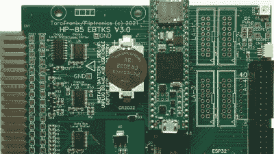
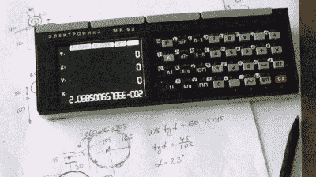
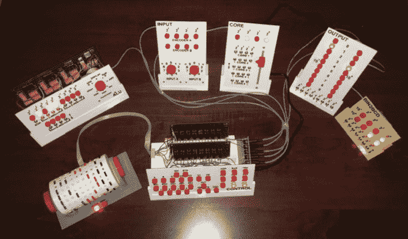

# 重塑复古大赛获奖名单公布

> 原文：<https://hackaday.com/2021/07/17/reinvented-retro-contest-winners-announced/>

好消息，各位！重塑复古大赛的结果出来了，这三个 groovy 项目的创作者都赢得了 200 美元的 Digi-Key 在线购物大奖。我们让您深入研究您的材料堆，并想出一种方法来更新一个又酷又旧的硬件，我们让您来决定它有多酷和多旧。

不管你的个人经历如何，你都可能使用过甚至制造过像[【迈克尔·韦塞尔】的下一代微电子](https://hackaday.io/project/176466-microtronic-the-next-generation)这样的教育电脑。这是 20 世纪 80 年代早期西德 4 位微处理器训练器 Busch 2090 微电子计算机系统的再创造。你可能从未听说过，但[迈克尔]发誓这是有史以来最好的之一。几年前，【迈克尔】制作了[一个会说话的基于 Arduino 的微型电子仿真器](https://hackaday.io/project/11560-the-talking-microtronic-computer-system-emulator)，并把这个概念发展成为一个获奖的系统，使用 ATMega2560 Pro Mini 和诺基亚 5110 显示器。另外，它还可以作为盒式接口模拟器，插入 2090 的扩展端口。花些时间去[看看 YouTube 上的视频](https://www.youtube.com/playlist?list=PLvdXKcHrGqhekyx81EoCwQij1Lqylp0dB)或[直奔 gerbers，制作自己的视频](https://github.com/lambdamikel/Busch-2090/tree/master/microtronic-nextgen-sh1106-spi)。

EBTKS – a tape drive replacement for HP Series80 computers

Resurrected MK-52 calculator now does things it could never have dreamed of

逆向计算爱好者将会喜欢 [EBTKS](https://hackaday.io/project/180400-ebtks-hp85ab-tape-drive-replacement) ，这是一个试图通过模仿 HP85A 和其他 20 世纪 80 年代早期惠普电脑中正在瓦解的磁带机，并通过 SD 卡提供 20，000 个虚拟磁带的项目。该项目最初是使用 Teensy 和 ESP32 作为固态替代品，但[Philip]和团队意识到他们可以做得更多。完整的功能列表包括 70 个新关键字以及磁盘和磁带驱动器模拟。在[项目的主要文档网站](http://www.fliptronics.com/EBTKS/index.html)上，一切都有详细的解释，在那里你还可以找到一份方便的用户指南。

如果你对旧的苏联装备情有独钟，看看[【ptrav】的 MK-52 复活](https://hackaday.io/project/176772-mk-52-resurrect)。[ptrav]拿了一个 90 年代早期的老式计算器，它的真空荧光显示屏已经坏了，然后用 ESP32 和 320×240 TFT 屏幕给它注入了新的生命。重点不仅仅是复活 MK-52，而是创造一个可编程苏联计算能力的凤凰，从灰烬中升起，实现其硬件释放的潜力。作为软件开发路径的一部分，[ptrav]还用 C#构建了一个全功能的模拟器，你可以[在 GitHub](https://github.com/myak555/MK-52_Resurrect) 上查看。

## 

## 最光荣的提名

从我们看到的所有令人惊叹的项目中选出优胜者总是很困难。在这次比赛中，我们选择了[【迈克尔盖迪】的 WDC-1](https://hackaday.io/project/168833-wdc-1-a-working-digital-computer)——也就是回形针电脑——作为荣誉奖。这不仅仅意味着公开的表扬——[迈克尔]已经为[汀蒂](https://tindie.com)赢得了一张价值 25 美元的礼品卡。干得好，[迈克尔]！

这 WDC-1 是一个有点逆向采取重新发明的复古概念。[Michael]没有在旧盒子里放入新技术，而是采用了现代 PCB 制造和 3D 打印技术来容纳这个 50 多年历史的计算机设计的升级版自制元件。

祝贺所有的获胜者，非常感谢所有 138 位参赛者为你们的怀旧风格做出的贡献。这个周末花些时间去看看它们，让你的另一个现实开始吧。