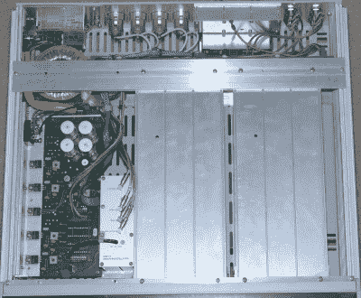

# 记住 NICAM:深入探究广播遗产

> 原文：<https://hackaday.com/2022/07/10/remembering-nicam-deep-dive-into-a-broadcasting-legacy/>

虽然对许多人来说，彩色电视的引入似乎是模拟广播电视的巅峰，但在 20 世纪 70 年代，随着电视广播的发展，出现了立体声音频系统，包括全数字 NICAM。随着 NICAM 广播已经停止了大约十年，用于编码和调制 NICAM 的演播室设备现在可以便宜地买到了。这导致[马修·米尔曼]不仅买了一堆飞利浦 NICAM studio gear，还[拆掉了它们](https://www.mattmillman.com/remembering-nicam-part-1-broadcast-equipment-teardown/)和[建立了一个完整的工作 NICAM 编码/解码系统](https://www.mattmillman.com/remembering-nicam-part-2-recreating-a-pal-i-signal-and-receiving-it-with-something-fancy/)，其中一个 Arcam Delta 150 作为接收器，飞利浦 PM5687 编码器。

Philips PM5687 with lid off.

最后，对飞利浦 PM5688 [测试接收机进行了分析](https://www.mattmillman.com/remembering-nicam-part-3-philips-pm5688-test-receiver-teardown/)。这是工作室用来确保 NICAM 编码和调制系统正常工作的组件。虽然公共 [NICAM](https://en.wikipedia.org/wiki/NICAM) 广播始于 20 世纪 80 年代末，但该系统最初是为了在传输系统中实现音频数据的点对点传输而开发的。由于该系统的数字特性，这变得非常容易，并且一旦接收器变得足够便宜，使其能够用于公共广播变得相对简单。

值得注意的是，NICAM 只在欧洲和一些亚太国家使用，其他国家使用德国的 Zweikanalton。这是一个纯粹的模拟(两个调频频道)系统，美国选择使用其 [MTS](https://en.wikipedia.org/wiki/Multichannel_Television_Sound) 系统，这与德国系统在传输电视信号的同时传输多个调频频道非常相似。随着数字电视逐渐取代模拟电视传输，NICAM、MTS 和其他公司的未来已经注定，留给我们的只有这些时间胶囊，我们可以使用旧的演播室设备来构建。