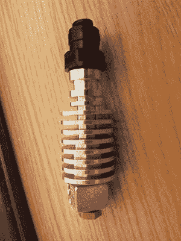
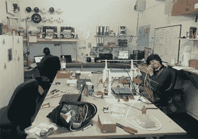

# 缅怀 3D 打印领域的先驱和梦想家桑杰·莫蒂默

> 原文：<https://hackaday.com/2021/12/01/remembering-sanjay-mortimer-pioneer-and-visionary-in-3d-printing/>

周末，[桑杰·莫蒂默去世](https://e3d-online.com/blogs/news/sanjaymortimer)。这对他一生中直接和间接接触过的许多人来说是一个巨大的打击。我们会记得 Sanjay 是 3D 打印社区的先驱、黑客和受人爱戴的代言人。

如果你对 3D 打印有所涉猎，你可能会想起桑杰，他是挤压公司 E3D 富有魅力的董事和联合创始人。他总是充满热情地展示他和他的公司正在开发的东西，以推动 3D 打印越来越远。但他也很体贴，是社区里许多人的朋友。

我们来谈谈他的一些足迹。

## 持续建造的酒店和喷嘴生态系统

Sanjay and Dave’s V4, the Hotend that launched E3D

想想离你最近的 3D 打印机。也许它藏在车库的角落里，或者在工作中制造零件。是 Prusa MK3 吗？一个大箱子？工具更换者？也许是用赫莫拉挤压机定制的？然后，即使你不知道，Sanjay 的手在你的车间，确保你的经验推动塑料通过一个微小的喷嘴是不亚于一流的时间。

回到 2012 年，Sanjay 白天是一名全职教师。但在工作之余，他和戴夫·兰姆正在对 RepRap 打印机的早期版本进行修改，特别是 hotends。在学校的机械车间里，他们的最新酒店设计取得了一定的成功，两天之内就销售一空，他们的朋友约书亚·罗利加入进来，成立了 E3D，剩下的就是酒店和历史了。

从那以后，E3D 成长为今天这样一家广受认可的公司。尽管桑杰毕业后成为了 E3D 的导演兼发言人，但他身上带着一种突然发现的热情，就像他从未离开过工作台一样！相反，他热情好客的态度让我们觉得他是在把我们拉进 E3D 早期的“鸡舍”车间，带我们参观他们最新最棒的产品。

Sanjay in the old E3D “Chicken Shed” ca. 2013.

当然，桑杰并没有亲自设计 E3D 的所有细节，但是，作为代言人，他支持这一切。在他的监督下出现了大量的概念。在过去的十年里，他帮助标准化了可互换部件的 hotend 生态系统，这让我们黑客可以随心所欲地混合和修改 3D 打印机硬件。它让我们试验他们自己的兼容螺丝的硬件，让社区作为一个整体，通过启用小的调整，建立一个端到端的工作设置，推动边界向前发展。

与格雷格·霍洛韦一起，他帮助奠定了现代的、经济的工具更换的基础，这是一种足够可靠的取用和停放酒店的方法，能够毫无故障地这样做数千次。他通过教 3D 打印机如何减去 T1，也就是说，精确地添加和删除材料，这在传统的设置中是不可能的，从而帮助这个设置更进一步。在这段时间里，Sanjay 以极大的热情鼓励我们不断调整我们的机器，以追求更快、更好、更高性能的东西。

## 开放的技术，开放的社区

有时很难看到公司精神背后的人，但桑杰不是这样。

很明显，桑杰关心教育他所在的社区。Sanjay 在产品访谈中的对话是不同的；他们是技术性的。当其他公司急切地引用他们的专利来告诉你为什么他们的产品有价值时，Sanjay 会用技术成就本身吸引你。很明显，他了解他所接触的社区的能力，他也会这样对待谈话。这种差异让他对即将到来的几何变化和特殊耐磨涂层着迷，因为一群人可能会像他一样欣赏这些变化。

这种教育精神远远超出了简单的产品讨论。自从他们开始发布产品以来，E3D 的文档就成了无处不在的主食，并且在去年取得了突飞猛进的发展。E3D 的刀具更换器设计是完全开源的。这些不仅仅是友好的姿态；他们与创办公司的人的精神气质直接相关，并向他们来自的黑客社区致敬，桑杰也是其中一员。他以身作则，向我们展示了如何在慷慨提供社区知识的同时建立一家盈利的公司。

## 敞开心扉

我第一次与桑杰互动是在我发布的一个 YouTube 视频上，他分享了他对我正在缓慢推进的一个项目的兴奋。作为一名在学校大楼里度过漫漫长夜的研究生，几乎任何人，更不用说 Sanjay，突然告诉我他们喜欢我的工作，都是一件令人兴奋的事情。在一个朋友的鼓励下，我带着这个项目参加了 2019 年中西部 RepRap 节。在活动的前一天晚上，我在一家酒吧的柜台前遇到了耐心等待调酒师的桑杰。从 YouTube 视频中拿出同样的机制，他立刻认出了我，脸上带着灿烂的笑容，给我买了瓶啤酒，让我和他的伙伴们坐在桌子旁边，和他的其他成员分享。

在那一刻，我意识到桑杰身上有一种奇妙的东西。当然，和许多人一样，我知道他是一个支持公司工作的热情人物。但在那一刻，他变成了一个真实的，有思想的人，他也会支持你。这种友谊震撼了我的世界。对他来说，我可以是任何人。但是，由于他热情的态度，我认为他知道任何人都可以给 3D 打印带来新的东西。

现在对 Sanjay 有了更多的了解，我相信其他人也有过类似的经历。

## 带着那种欢呼吧

我们很少能跟在某个领域的前沿人物身边，而他们每一步都带着你，但那是我们作为黑客和 Sanjay 一起度过的时间。他带领我们踏上了制造硬件的伟大征程。他向我们展示了如何成长，并带着我们童年的热情。他给我们留下了一份非凡的遗产，以及如何分享和相互学习的榜样。

安息吧，伙计。

 [https://www.youtube.com/embed/TaibgPqYpSg?version=3&rel=1&showsearch=0&showinfo=1&iv_load_policy=1&fs=1&hl=en-US&autohide=2&wmode=transparent](https://www.youtube.com/embed/TaibgPqYpSg?version=3&rel=1&showsearch=0&showinfo=1&iv_load_policy=1&fs=1&hl=en-US&autohide=2&wmode=transparent)

