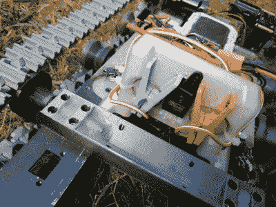

# 以中世纪风格远程浏览启示录

> 原文：<https://hackaday.com/2020/06/02/remotely-navigate-the-apocalypse-in-mid-century-style/>

疫情带来的为数不多的积极因素之一是，稀缺的限制性本质可能有利于创造力。此外，这一切的厄运和黑暗正导致人们放松下来，做一些他们在以前时代的苛刻世界中从未感到足够自由去做的事情。

例如，[ossum]按照严格的标准制造遥控车辆，但在完美的基础上稍作休息，凭自己的直觉制造了这款遥控地狱旅行车。这是一个相当足智多谋的构建，结合了以前项目的一些部分，一些标准的 R/C 部件和一些巧妙的技巧。

 车身是几年前【奥索姆】为某人制造的 1957 年雪佛兰 Suburban 面包车的测试版。它安装在废金属底盘上，在为不同车辆设计的印刷坦克履带上移动。

由于玻璃在启示录中是一种负担(也因为[ossum]还没有树脂打印机)，窗户有强化的覆盖物，这些覆盖物被打印、包浆，并带有微小的铆钉头。

至于黑客去，我们最喜欢的是晾衣夹转向。[ossum]只有一个电子速度控制器，所以他使用一个伺服系统来驱动一对弹簧夹，在两者之间交替移动油罐车。休息后有一个简短的视频，显示了齿条和衣服齿轮转向，它是在面包车的简短演示后加载的。

我们意识到每个人的启示需求是不同的，但这里有足够的东西让你开始。没有足够的遥控零件？[齿轮箱和驱动轴也可以打印](https://hackaday.com/2020/04/09/the-evolution-of-a-3d-printed-off-road-r-c-car/)。

 [https://www.youtube.com/embed/1XX02loZmSc?version=3&rel=1&showsearch=0&showinfo=1&iv_load_policy=1&fs=1&hl=en-US&autohide=2&wmode=transparent](https://www.youtube.com/embed/1XX02loZmSc?version=3&rel=1&showsearch=0&showinfo=1&iv_load_policy=1&fs=1&hl=en-US&autohide=2&wmode=transparent)

 [https://www.youtube.com/embed/TVR3P_LEgd0?version=3&rel=1&showsearch=0&showinfo=1&iv_load_policy=1&fs=1&hl=en-US&autohide=2&wmode=transparent](https://www.youtube.com/embed/TVR3P_LEgd0?version=3&rel=1&showsearch=0&showinfo=1&iv_load_policy=1&fs=1&hl=en-US&autohide=2&wmode=transparent)

