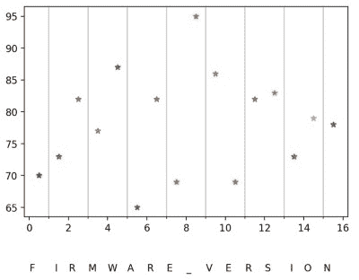

# Remoticon 视频:破解加密固件研讨会

> 原文：<https://hackaday.com/2020/12/11/remoticon-video-breaking-encrypted-firmware-workshop/>

如果你能得到代码来修复你心爱的电子小工具上损坏的功能就好了。但是等等，硬件黑客有技能编写自己的固件…只要我们能把编译好的二进制文件转换成硬件需要的格式。

幸运的是，我们有 Uri Shaked 来引导我们完成这个过程。来自 2020 Hackaday Remoticon [的这个研讨会演示了如何破译 3D 打印机固件二进制文件](https://youtu.be/fgbinkP9XwQ)上使用的加密方案。在这个过程中，我们了解了对许多加密二进制解密冒险有用的工具和技术。

 [https://www.youtube.com/embed/fgbinkP9XwQ?version=3&rel=1&showsearch=0&showinfo=1&iv_load_policy=1&fs=1&hl=en-US&autohide=2&wmode=transparent](https://www.youtube.com/embed/fgbinkP9XwQ?version=3&rel=1&showsearch=0&showinfo=1&iv_load_policy=1&fs=1&hl=en-US&autohide=2&wmode=transparent)

这个研讨会的起源故事开始于 Uri 决定成为 Kickstarter 上一个 3D 打印机的支持者，这个 3D 打印机有不错的硬件，但固件很垃圾。这是他第二次上当，但第一次有人通过编写定制固件来使事情顺利运行，从而挽救了他的咸肉。这一次，社区在运行定制代码之前需要帮助对新的二进制格式进行逆向工程，所以 Uri 立即行动起来。

在研讨会期间，他使用 CoLab 笔记本来帮助每个人了解他运行 Python 和 Linux shell 命令的组合。你可以在研讨会指南上找到所有内容的[链接，但老实说，这里没有多少秘方。真正的要素是独创性，作为一个十六进制转储器来可视化代码，而 Python 来处理它完成了大部分过程。](https://docs.google.com/document/d/1ZUO18IQo8SM7KwomjoS2TAys_yBT7ZrloDk01BPmp-s/edit#)

由于以前的打印机型号的固件使用替代密码，Uri 尝试压缩目标二进制文件。似乎使用像 AES 256 这样的健壮加密将很难有效地压缩。由于 bin 文件从 58 kb 下降到 38 kb，很有可能这只是一个替换。

接下来，他运行一个直方图来绘制重复出现的字符，很快就可以看出哪个二进制值代表 0x00，因为这将是最常用的值(想想 32 位数字上的前导零)，以及通常填充二进制结尾的 0xFF。通过查找 STM32 微控制器的数据手册，发现矢量复位表总是放在程序存储器的开头，这进一步证实了这一点。由于该表中的许多值是已知的，并且指定了未知值的位置，因此这成为开始解密工作的关键。

剩下的就是寻找混淆字符串的有趣游戏了。Uri 使用了 [DotPeek](https://www.jetbrains.com/decompiler/) 来反编译。NET 计算机软件，控制打印机并定位软件在串行连接上监听的几个字符串。因为打印机会把它们发送到计算机，所以它们一定存在于二进制文件的某个地方。

Plot shows the distribution of repeated characters in the string “FIRMWARE_VERSION”. Used to visualise the pattern (not the actual values themselves) which is then searched for in the binary file.

该图显示了为可视化字符串中的重复而编写的函数 Uri[。他用它来判断一个字符串是否有足够的重复，以作为二进制中唯一可识别的模式，然后显示每个值的替换。在这里，他不断碰壁，直到突然发现二进制中的字节对是颠倒的。从那里，他迅速开始拼凑一个替换表——使用他用 Python 编写的自定义十六进制转储视图来检查整个过程。](https://urish.medium.com/visualizing-repetitions-in-string-using-python-and-matplotlib-5e4e1ddff0c9)

由于变焦录制出现问题，研讨会实验部分之后的部分没有录制，但是您需要的一切都可以在此视频中找到。跟随 Uri 的领导，下载他链接的文件，看看您是否能找到自己的方法来完成其余的替换。

这是一个很棒的方法来更好的完成这种去泡沫的任务。我们既有二进制本身，也有 Uri 对这段经历的第一手回忆来指导我们。这项工作很大程度上是一个没有图片的拼图游戏，但就像生活中的大多数事情一样，随着你做得越来越多，你会找到窍门的。