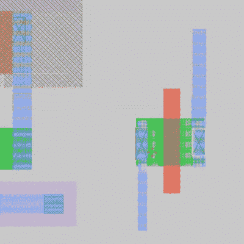
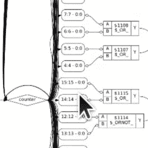

# 遥控视频:从零到专用集成电路:如何在硅片上设计

> 原文：<https://hackaday.com/2020/12/29/remoticon-video-from-zero-to-asic-how-to-design-in-silicon/>

在家庭作坊里一个人设计自己的集成电路听起来像科幻小说。但在 20 年前，你也可以自己制作电路板，安装一个 600 MHz 的微控制器，并自己编写固件。事实证明，硅设计并不像过去那样遥不可及，Matt Venn 向我们展示了他在 T2 工作室的诀窍。

这是在 2020 年 Hackaday Remoticon 期间举行的，是对 Skywater PDK 中使用的工具的指导之旅，这是一种开源 ASIC 工具包，由谷歌和 SkyWater Technology 合作开发。我们在六月第一次宣布的时候报道了这个消息[，但是这是我们看到的对实际设计过程最全面的观察。](https://hackaday.com/2020/06/30/your-own-open-source-asic-skywater-pdf-plans-first-130-nm-wafer-in-2020/)

Drawing N-channel MOSFET in silicon

Matt 从一个非常简单的 N 沟道 MOSFET 设计开始，使用类似于图形编辑软件的点击和拖动工具构建演示。好消息是，虽然你可以像这样画出自己的结构，但是对于数字设计来说，你不必这样做。各种各样的 IP 已经[贡献给了开源项目](https://github.com/google/skywater-pdk)，允许使用 HDL 引入基本的构建模块。然而，对于那些需要模拟设计作为项目一部分的人来说，绘制结构的能力肯定会成为他们的游乐场。

与用于电路板的 EDA 软件一样，PDK 包括设计规则检查，以确保您不会违反 130 纳米芯片制造的限制。还有一些其他的黑魔法，因为 Matt 特别提到了天线规则检查，以保护您的设计在制造过程中不会被“大”(微观上如此)金属化线路上的感应电流烧毁。

Part of a massive logic flow chart for an IC counter design

当前的工作流程涉及到大量配置文件，Matt 承认他花了很长时间才明白过来。然而，用来检验你的设计的东西是非常令人印象深刻的。他演示了 SPICE 模拟来计算时序，并展示了许多由编译过程生成的验证图的示例，或者是以看到布局结构的形式，或者是以逻辑流程图的形式。这是至关重要的，因为单次运行需要 2-3 个月才能从 fab 返回——您希望在完成项目之前把事情做好。顺便说一句，这就是所谓的“tapeout”，这个术语你可能在~~之前就听说过，他说它来自于一卷卷的磁带，这些磁带包含了从计算机中取出并送往生产的设计。谁知道呢？~~(这个带删除线的花絮貌似不正确)。【T2

但是等等，这不仅仅是设计这些东西。Skywater-PDK 项目的部分阴谋是，谷歌购买了一个大约每个季度运行一次的小组，以便开源设计可以免费整合到一个多项目晶片上，供提交它们的人使用。这真是太棒了，我们很高兴听到人们将他们的晶圆级芯片级器件(也称为倒装芯片)带回测试的消息。马特正在[计划一个关于这个话题的更深入的付费课程](https://www.zerotoasiccourse.com/)。现在，休息之后，让我们来领略一下这个优秀的工作室所包含的内容。

 [https://www.youtube.com/embed/lq2BpWwcyQM?version=3&rel=1&showsearch=0&showinfo=1&iv_load_policy=1&fs=1&hl=en-US&autohide=2&wmode=transparent](https://www.youtube.com/embed/lq2BpWwcyQM?version=3&rel=1&showsearch=0&showinfo=1&iv_load_policy=1&fs=1&hl=en-US&autohide=2&wmode=transparent)

