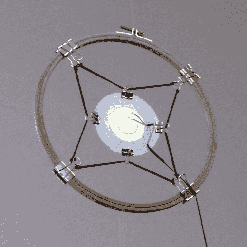
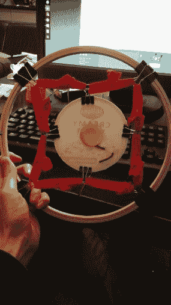
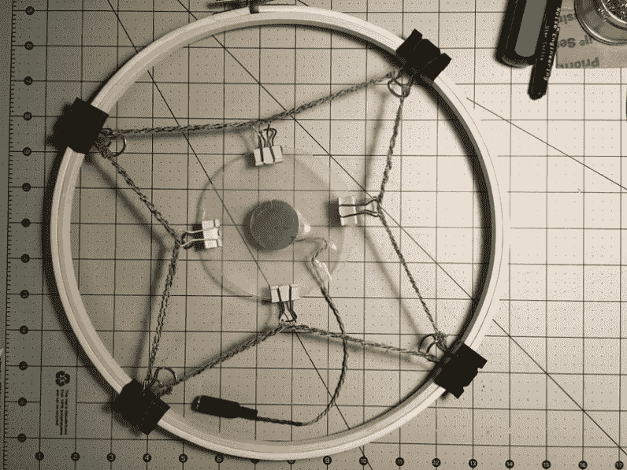

# Remoticon 视频:制作麦克风和寻找声音

> 原文：<https://hackaday.com/2020/12/08/remoticon-video-making-microphones-and-finding-sound/>

酸奶盖和刺绣圈是制作这款话筒的关键部件。这是一个技术含量极低的入门级项目，旨在进入“发现声音”领域，并准确了解在音频世界中开始黑客活动所需的内容。Helen Leigh 和 Robyn Hails 举办的这个研讨会将向您展示如何制作一个简单的麦克风，并将其用作各种音频恶作剧的电子网关。

这个建筑的关键是压电元件和一个放大器来处理它产生的信号。所有其他材料在大多数家庭中都很常见，但把它们放在一起，就像 2020 Hackaday Remoticon 的现场实践研讨会所示，我想你会惊讶于这东西听起来有多好！

 [https://www.youtube.com/embed/ZD7eq1f0wWg?version=3&rel=1&showsearch=0&showinfo=1&iv_load_policy=1&fs=1&hl=en-US&autohide=2&wmode=transparent](https://www.youtube.com/embed/ZD7eq1f0wWg?version=3&rel=1&showsearch=0&showinfo=1&iv_load_policy=1&fs=1&hl=en-US&autohide=2&wmode=transparent)

麦克风接收到空气中传播的音频波的微小振动。诀窍是挑选正确的振动，避免错误的，这是这个设计的指导原则。首先，从酸奶容器的盖子上切下的塑料隔膜充当压电元件的锚点，充当共鸣板来拾取那些微小的音频振动，压电元件将这些振动转化为电信号。

通过使用文件装订夹(最好是金色)和松紧带将该组件悬挂在木制刺绣环内，可防止其穿过话筒安装装置。这里有一些危险因素，因为不平衡的麦克风信号有可能吹爆您的扬声器，所以请务必将增益设置为最低，并在调高音量时小心行事。

  Built by workshop presenters  Built by attendee  Built by attendee

许多研讨会与会者在公共聊天室发布了他们完整的话筒照片，您可以在研讨会项目页面上找到这些照片。如果你想自己建造一个[，你可以在这里找到材料清单](https://docs.google.com/document/d/1GOvh1SEBerrscw-QRgLKTqGTzUrZpcvktCOg6UUnCdU/edit#heading=h.tzm2nf7jguiu)。

虽然如今高灵敏度的麦克风在我们手边的电子产品中随处可见，但将这一概念简化为最基本的概念比简单地打开手机上的录音应用要酷得多。一旦你接触到压电输入，环顾四周，开始将它们添加到各种各样的电子对象中，这样它们就可以成为你下一次音频创作的声源。