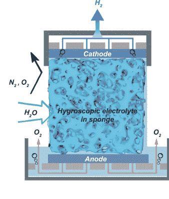

# 从稀薄的空气中吸取可再生的氢

> 原文：<https://hackaday.com/2022/09/11/renewable-hydrogen-sucked-from-thinish-air/>

储存氢通常被吹捧为终极绿色能源解决方案，前提是氢是由真正的绿色能源生产的。但是，在你的普通房子用泵送或储罐储存的氢气供暖之前，还有一些技术问题需要克服。一个问题是，那些拥有大量可再生能源的地方，并不总是能够获得大量的纯净水，而对于电解来说，你确实需要这两者。墨尔本大学的一个团队想出了一个有趣的方法，直接从空气中电解产生氢气。

Redder areas have more water risk and renewable potential

通过利用一种具有吸湿性电解质的新型电解槽，所谓的直接空气电解(DAE)可以在相对湿度低至 4%的情况下运行，即使在最干旱的地区也非常好，毕竟可能没有云，但空气中仍然含有一点水。这与世界上的一些地区特别相关，如沙漠，那里同时存在高度的水风险和大量的太阳能潜力。直接电解沿海地区提取的盐水是一种选择，但处理释放的氯是一个大问题。

新的原型在结构上非常简单，用三聚氰胺海绵或烧结玻璃泡沫浸泡在兼容的电解质中。尝试了氢氧化钾(碱性)以及乙酸钾(碱性)和硫酸，但是后者在短时间内降解了主体材料。谁会想到呢？无论如何，对于电解槽设计，一个关键问题是确保分离的气体保持分离，在这种情况下，也与空气分离。这一点通过安排电解液海绵完全覆盖两个电极得到了巧妙的保证，因此当吸湿材料从空气中提取水时，结构中的微通道充满液体，接触电池的两端，形成电路并允许电解进行。

氢很轻，会通过阴极上的孔上升，被收集和储存起来。氧气通过底部的贮液器后，简单地回到空气中。超级简单，从报纸上看，也很有效。

你可以想象一个建立在这个基础上的未来，一个周末，你开着你的氢燃料电池驱动的沙滩车绕着撒哈拉沙漠行驶，你在一个太阳能氢燃料站停下来加油，吃馅饼。好吧，可能不是最后一点。

承诺的氢经济可能正在慢慢接近。我们介绍了如何使用铝纳米粒子从水中提取氢气。但是一旦你有了气体，你需要储存和处理它。[丰田可能会对那辆](https://hackaday.com/2022/08/02/toyotas-cartridge-helps-make-hydrogen-portable/)有一个计划。那么也许直接处理天然气根本就不是一个好主意，也许[的未来就是浆糊](https://hackaday.com/2021/02/06/the-future-of-hydrogen-power-is-paste/)？

感谢[MmmDee]的提示！