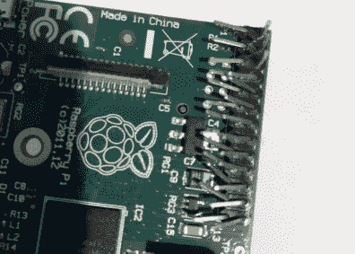
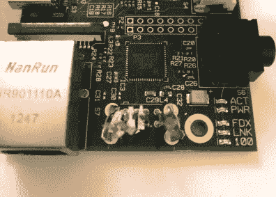

# 修复 200+树莓 Pis 为一个好的原因

> 原文：<https://hackaday.com/2021/01/25/repairing-200-raspberry-pis-for-a-good-cause/>

如果有人告诉你他们最近购买了超过 200 个 Raspberry Pis，你可能会认为他们正在从事某种大规模集群项目。但在这种情况下， [[James Dawson]购买了这些损坏的单板电脑，打算修复它们](https://blog.jmdawson.co.uk/i-bought-200-raspberry-pi-model-bs-and-im-going-to-fix-them-part-1/)，这样它们就可以被送到发展中国家的学校使用。这听起来像是逻辑证明有点棘手，但我们很高兴地报告，他至少在让 Pis 恢复运行方面取得了良好的进展。

他得到了这批他认为是顾客退回的覆盆子，价值 61 英镑(83 美元)。在这个价格上，即使只有一小部分最终可以修复，你仍然会领先。假设所有这些看起来都是最早的 B 型车，但在我们的书中，这仍然是一笔了不起的交易。当然，假设你能找到一些合理的方法对它们进行分类，找出值得保留的东西。

为此，[James]想出了一个 Bash 脚本，允许他检查几个硬件组件，包括 USB、以太网、I2C 和 GPIO。有了 SD 卡上的脚本和插入 Pi 输出头的 3.5 英寸 TFT，他能够快速浏览盒子，了解自己陷入了什么样的麻烦。当他写这篇博文的时候，他只完成了这个过程的一半，但是到那时，他已经找到了 40 个根本不会开始的 pi。他怀疑这些可能是电源电路中一些常见问题的受害者，他将在以后进行调查。

  A metal ruler made short work of bent pins.  A nasty, but repairable, problem.

他检查的大多数 Pis 都没有比 GPIO 引脚弯曲或 SD 卡插槽损坏更严重的问题。一些更滥用的例子有他们的 USB 端口被完全扯掉，但在其他方面都很好。另外 10 个有死以太网，4 个似乎有损坏的痕迹，导致他们的 HDMI 端口。虽然我们很想听听[詹姆斯]是否能让那 40 个黑暗 pi 重新开火，但到目前为止结果还是很有希望的。

[捐赠硬件总是一件棘手的事情](https://hackaday.com/2017/04/14/the-complex-issue-of-hackspace-donations/)，所以现在【James】说他将在易贝出售修好的 Pis，并将收入捐给 Raspberry Pi 基金会，这样他们就可以继续[开发硬件，这将(可能)实现他们的目标](https://hackaday.com/2020/11/02/new-raspberry-pi-400-is-a-computer-in-a-keyboard-for-70/)给全世界的学生一台功能正常的计算机。