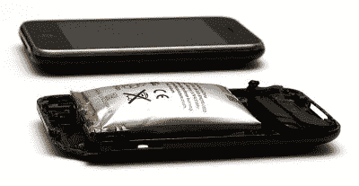
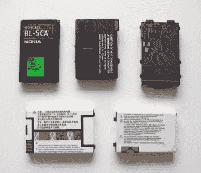
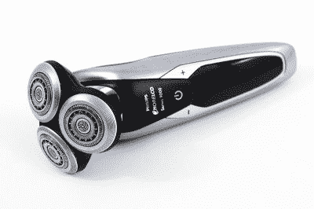

# 如果欧盟如愿以偿，可替换电池将重返手机市场

> 原文：<https://hackaday.com/2022/03/30/replaceable-batteries-are-coming-back-to-phones-if-the-eu-gets-its-way/>

在过去，几乎所有使用电池的东西都有一个舱口或储箱，如果需要，你可以打开它把它取出来并更换它。无论是收音机、无绳电话还是手机，更换电池都是轻而易举的事情。

如今，许多设备都将电池藏在防篡改标签和“内部没有用户可维修组件”的警告下面然而，欧盟希望改变这一切，并投票要求从手机到电动自行车的所有东西都必须有易于更换的电池，这项立法最早将于 2024 年生效。

## 回到过去的方式

Many phone batteries are designed to be non-replacaeble from the factory. Thus, when they swell up or fail, they can damage the whole phone rather than merely popping off a removable panel. Credit: [Mpt-matthew, CC-BY-SA-3.0](https://commons.wikimedia.org/wiki/File:Expanded_lithium-ion_polymer_battery_from_an_Apple_iPhone_3GS.jpg)

曾几何时，大多数常用电池都是原电池——一次性物品，不能充电，使用后要丢弃。自然，这意味着依靠电池供电的设备可以使更换电池变得快速简单。

快进到现代。我们的许多电器，尤其是手机，依赖于可充电锂电池。由于它们是可充电的，制造商决定我们不再需要更换它们，并开始将它们密封在设备中，这样它们就不会受到不洗手的大众的干扰。

设计理念的这种变化通常有许多原因，随着智能手机制造商转向采用更奇特材料的优质密封设计，这种变化缓慢地冲击了市场，然后突然爆发。一些人声称这是为了给客户提供更干净、舒适的用户体验，而另一些人则引用了带有永久安装电池的设备在包装和小型化方面的优势。它还使产品防水变得更容易，这一功能在智能手机市场上一直是一个特别困难的设计挑战。

然而，这种设计的缺点是，如果电池失效，设备就变得无用，并且经常被扔掉。虽然人们可以在现代智能手机和其他没电的设备上进行手术，但对于没有经验的人来说，这是一个充满危险的过程，可能会导致设备本身的损坏或毁坏。同样重要的是，如果不能取出电池，如何回收？

A series of replaceable smartphone batteries from the GSM era. Few of us needed to swap them out regularly, but it could save you some trouble if you got caught short of charge in a bad spot and a friend had some juice left in a similar phone. Credit: [Phrontis, CC-BY-SA-3.0](https://commons.wikimedia.org/wiki/File:Li-Ion_batteries_for_mobile_phones.jpg)

作为欧盟[新电池法规](https://www.europarl.europa.eu/legislative-train/theme-a-european-green-deal/file-revision-of-the-eu-battery-directive-(refit)/01-2022)的一部分，这一切都将改变。[这些法规的文本](https://oeil.secure.europarl.europa.eu/oeil/popups/printficheglobal.pdf?id=721444&l=en)要求电池在各种设备中易于拆卸、更换和回收。这包括智能手机和其他典型的消费电器，以及电动自行车和电动滑板车等“轻型交通工具”的电池。

到 2024 年 1 月 1 日，这些设备的设计必须能够使用“基本和常见的工具”安全地移除和更换电池，并且“不会对设备或电池造成损坏。”制造商还必须提供拆卸和更换程序的文件。该文档还必须在产品的预期生命周期内在线提供。

这一措施可能会彻底改变欧盟市场各种技术的设计。如今，各种电器都使用集成的隐藏电池——从顶级智能手机到行动相机和电动剃须刀，无所不包。所有这些产品都必须重新设计，以方便电池的拆卸和更换。

当然，这不是不可能的，无论如何。就在大约五年前，许多智能手机还将可拆卸电池作为标准配置。然而，这将需要工程师们从头开始，也许要在纤薄、材料和风格方面做出一些权衡。这是欧盟的一个有力举措，与其推动整个智能手机行业的充电器标准化一脉相承。像这项立法一样，这项措施对于厌倦了扔掉带有不可替代电池的设备的消费者来说可能是一个巨大的胜利。

Many devices, like this Philips Norelco 9700 shaver, feature in-built batteries. The company specifically advisers customers not to attempt “to open the product to
remove or replace the built-in rechargeable
battery.” Credit: [moo.review](https://moo.review/best-electric-shaver/), [CC-BY-2.0](https://commons.wikimedia.org/wiki/File:Philips_Norelco_9700_Rotary_Electric_Shaver_(30973817280).jpg)

欧盟在向电子垃圾宣战时，也不仅仅是强制要求可替代性。它伴随着一个更“循环经济”的大力推进，这种经济更依赖于回收现有的材料，而不是仅仅依靠挖掘新的材料。收集废旧便携式电池的目标将被强制执行，到 2023 年底收集率从 45%开始，到 2030 年底上升到 80%。该法律还要求收集所有汽车、工业和电动汽车电池。

还有一些措施要求电池生产的可持续性。对于工业和电动汽车电池，从 2030 年开始，这些电池应该使用一定比例的回收电池材料。电池中使用的 12%的钴、85%的铅、4%的锂和 4%的镍应该来自回收资源。到 2035 年，钴的比例将提高到 20%,锂的比例将提高到 10%,镍的比例将提高到 12%,铅的比例将保持不变，因为这种金属的回收基础设施已经到位。

这项立法可能会带来很多好处。随着回收成为电池生产供应链的关键部分，采矿作业的压力将会降低，对环境的影响也会减少。此外，不再需要扔掉电池有问题的设备，更换简单易行。权衡的结果是，公司将不得不更加努力地工作来适应这些要求，同时一些设计可能会遭受较小的重量或尺寸损失。但是，如果这给了我们寿命更长的电器小发明，并促进了锂的回收，这是很难反对的。