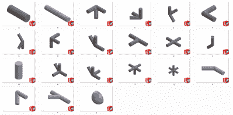
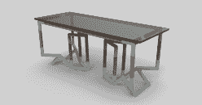
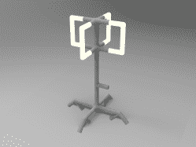
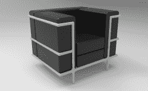

# 取代 3D 打印机和路由器:制造人体模型的工具

> 原文：<https://hackaday.com/2019/10/18/replacing-the-3d-printer-and-router-a-tool-for-manufacturing-human-scale-forms/>

当你意识到它的简单性时，[几何图形](https://hackaday.io/project/161645-geometer)的目的就变得显而易见了:[David Troetschel]的项目是创建一个易于理解的设计工具，鼓励面向目标的设计。该套件带有物理组件和数字对应组件，可以以模块化方式组合。它们各自具有特定的几何形状，这在保持制造简单的同时提供了通用性。

对于原型制作阶段，在 Formlabs 打印机上 3D 打印的小型咬合部件以较小的比例模拟模块组件。一旦设计构思完成，Geometer Grasshopper 程序最终确定了模型所需的模块排列，较大的部件就可以用作混凝土或水力铸模铸件的模具。

目前的模组已经是第七次了，最初是作为[Troetschel]的毕业论文开始的。从那时起，该项目本身就进入了一个广泛的原型阶段，在这个阶段中，组件已经从注塑成型到 3D 打印。

原型制作的整体过程比 3D 打印更快，比发送到第三方商店进行构建更具成本效益，这有助于实现该项目的目标，即让制造设计更容易实现。这是一个有趣的倡议，向 DIY 社区介绍了一种新的制作方法，我们很好奇这个想法在 makerspaces 中的应用。

The [HackadayPrize2019](https://prize.supplyframe.com) is Sponsored by:     