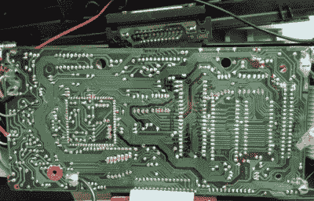

# 重新利用 20 世纪 90 年代的玩具电脑

> 原文：<https://hackaday.com/2019/10/14/repurposing-a-toy-computer-from-the-1990s/>

我们更年轻的读者很可能拥有一些 VTech 教育计算机的化身。从 20 世纪 80 年代中期到今天，伟易达一直在生产外形模糊的笔记本电脑小工具，旨在教授从基本阅读技能到世界历史的一切知识。这些设备的标志包括一个可怜的单色液晶显示器，令人不快的薄膜键盘，以及[热键]发现的[，偶尔一个合适的 Z80 处理器](https://hackaday.io/project/166921-v-tech-genius-leader-precomputer-hacking)。

像往常一样，它始于易贝。[HotKey]发现二手市场充斥着这些有几十年历史的教育设备，通常售价仅为几美元。事实证明，智能手机和平板电脑时代的孩子们似乎对 1991 年的“笔记本电脑”不太感兴趣。无论如何，他订购了大约 12 种不同的型号，并开始仔细研究它们，看看是什么让它们运转起来。

 他发现 20+岁左右的伟易达机器都在使用 Z80 处理器，而且它们共享一个相当标准化的外部盒式接口，用于添加附加软件或保存数据。在试图从盒式磁带端口转储一些数据时，[HotKey]发现它实际上是连接到计算机的主总线上的。他意识到，使用定制设计的墨盒，它应该能够接管系统并运行自己的代码。

经过一年多的修补和与 Z80 现场的其他黑客交谈，[热键]已经取得了一些令人印象深刻的进展。他不仅创建了一个定制的插件，可以让他加载新代码并连接到外部设备，而且他还为 z88dk 添加了对一些 VTech 机器的支持，以便其他人可以开始为这些机器编写自己的 C 代码。到目前为止，他已经创建了一些非常有前途的概念验证程序，如 MIDI 控制器和串行终端，但最终他希望创建一个类似 DOS 或 CP/M 的操作系统，将这些老式机器从简单的玩具提升到合法的多用途计算机。

我们在过去看到过 VTech 硬件被黑，但它通常集中在该公司最近的硬件上，如 Linux 驱动的 InnoTab。看看这些益智玩具能否满足[一些黑客拥有一个廉价便携的盒子来摆弄 Z80](https://hackaday.com/2019/09/17/a-curiously-strong-z80-in-your-pocket/)的梦想，这将是很有趣的。