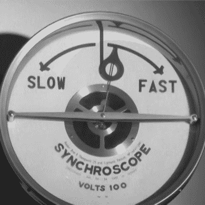

# 当电网脱离电网时重启电网

> 原文：<https://hackaday.com/2022/12/06/restarting-the-grid-when-the-grid-is-off-the-grid/>

如果你看 YouTube 的时间足够长，似乎最近流行“脱离网络”。但是如果脱离网格的东西是*网格本身*呢？在休息时间下方的[视频中，*实际工程*的【格雷迪】探索了一个问题:如何在整个电网离线后重启它？这是一个非常简单的深入探究，如何在不对电网和发电机本身造成重大损害的情况下，恢复大量用户的电力供应。](https://www.youtube.com/watch?v=uOSnQM1Zu4w)

What’s A Power Grid Operators Favorite Band?

我们当中与汽车交流发电机打过交道的黑客知道，为了发电，交流发电机必须受到激励。这是什么意思，它对电网有什么影响？简单来说，就是需要权力才能制造权力。例如，旧的重型设备有他们所谓的小马马达——一个容易启动的小引擎，唯一的目的是启动一个更大的引擎。飞机有辅助动力装置(APU)用于同样的目的。电网有哪些？你得看视频才能知道。

一旦至少两台发电机上线，电网运营商就可以扳动开关，开始向客户供电，对吗？不完全是。[Grady]再次使用一个巧妙的测试夹具和一个示波器来展示如果事情没有做好可能会发生的损害。这是一个非常值得一看的精彩视频。

了解电网运营商如何使用名为 LEGOS 的[电网仿真器来帮助他们保持电子流的正确方向。](https://hackaday.com/2021/06/26/emulating-a-power-grid/)

 [https://www.youtube.com/embed/uOSnQM1Zu4w?version=3&rel=1&showsearch=0&showinfo=1&iv_load_policy=1&fs=1&hl=en-US&autohide=2&wmode=transparent](https://www.youtube.com/embed/uOSnQM1Zu4w?version=3&rel=1&showsearch=0&showinfo=1&iv_load_policy=1&fs=1&hl=en-US&autohide=2&wmode=transparent)

